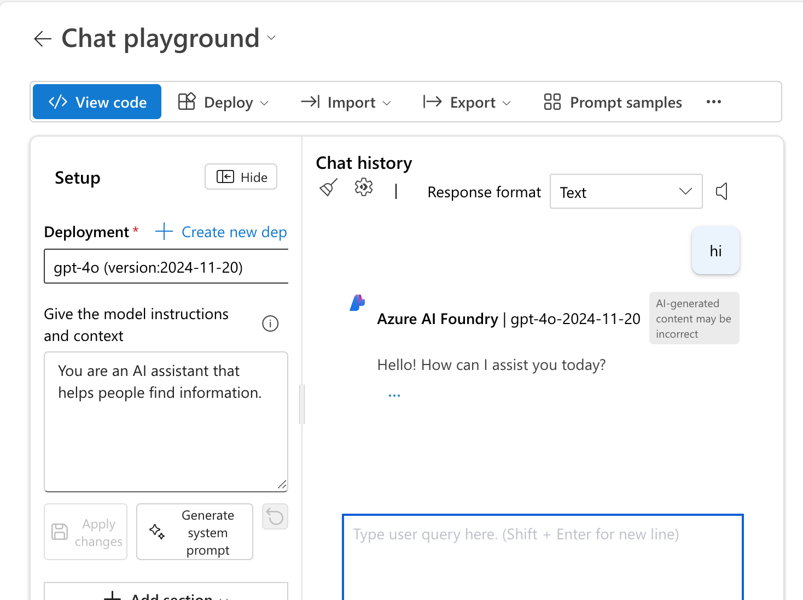
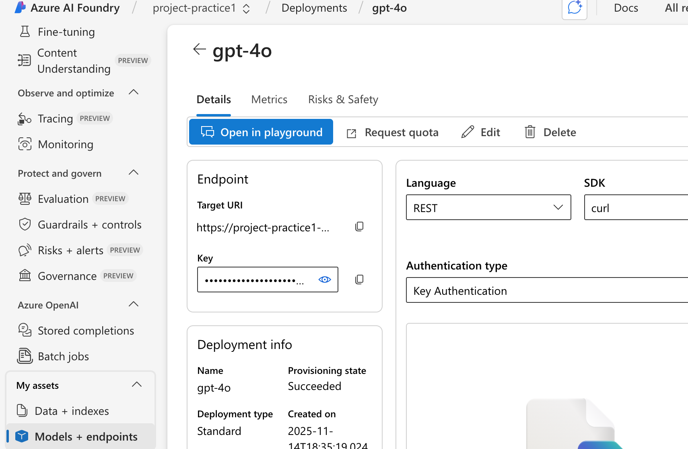
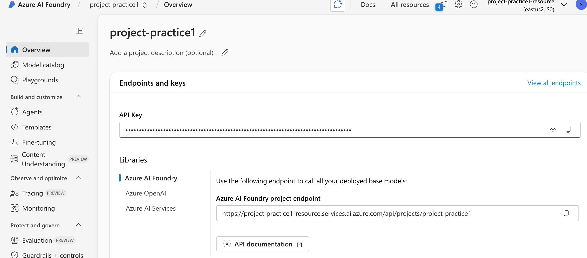

# 💬 Chat Application with Azure AI Foundry (GPT-4o)

This project demonstrates how to deploy a **GPT-4o model** using **Azure AI Foundry** and create a simple **Python client application** that chats with the deployed model.

---

## 🧩 Overview

In this exercise, you will:

1. Deploy the **GPT-4o model** in Azure AI Foundry.  
2. Configure a project and model deployment.  
3. Build a **Python chat client** using the **Azure AI Foundry** and **Azure OpenAI SDKs**.  
4. Interact with your model through a command-line chat interface.  

## 1. Deploy a model in an Azure AI Foundry project
Let's start by deploying a model in an Azure AI Foundry project.

1. Open a web browser and navigate to the Azure AI Foundry portal at https://ai.azure.com and sign in
2. In the home page, in the Explore models and capabilities section, search for the **gpt-4o model**; which we'll use in our project.
3. In the search results, select the gpt-4o model to see its details, and then at the top of the page for the model, select Use this model. When prompted to create a project, enter a valid name for your project and expand Advanced options. Select Create and wait for your project to be created.

<p align="left"></p> 


After selecting **Customize**, specify the following settings for your project:

- **Azure AI Foundry resource:**  
  Provide a valid name for your Azure AI Foundry resource.
- **Subscription:**  
  `CS-SUB-0445`
- **Resource group:**  
  Create or select an existing resource group.
- **Region:**  
  Select any *AI Foundry recommended* region.

> **Note:** Some Azure AI resources are limited by regional model quotas.  
> If you encounter quota limitations later in the exercise, you may need to create the resource again in a different region.

<p align="left"></p> 

4. If prompted, deploy the gpt-4o model using the Standard deployment type and customize the deployment details to set a Tokens per minute rate limit of 5K.
 
<p align="left"></p> 
 
> **Note:** Why Azure prompts to create a project when deploying a model--> Azure AI Foundry requires a project to manage model deployments, resources, and configurations. 
If no project exists when you select **Use this model**, Azure automatically asks you to create one. 
This project acts as the workspace where the model deployment, agent configuration, and related assets will be stored.

> **Note:**  Reducing the TPM helps avoid over-using the quota available in the subscription you are using. 5,000 TPM should be sufficient for the data used in this exercise. If your available quota is lower than this, you will be able to complete the exercise but you may experience errors if the rate limit is exceeded.

<p align="left"></p> 

5. When your project is created, the chat playground will be opened automatically so you can test your model:

<p align="left"></p> 

6. In the Setup pane, note the name of your model deployment; which should be gpt-4o. You can confirm this by viewing the deployment in the Models and endpoints page (just open that page in the navigation pane on the left).

<p align="left"></p> 

7. In the navigation pane on the left, select Overview to see the main page for your project; which looks like this:

<p align="left"></p> 

## 2. Create a client application to chat with the model


###  Prepare the Application Configuration

1. In the **Azure AI Foundry** portal, open your project and go to the **Overview** page.

<p align="left"></p> 

2. In the **Endpoints and keys** section:
   - Ensure the **Azure AI Foundry library** option is selected.
   - Locate your **Project endpoint** — this will be used to connect your application to your deployed model.

> **Note:** You can also use the **Azure OpenAI endpoint** if preferred.

###  Prepare the Application Configuration to connect with Azure OpenAI enpoints

```bash
model_deployment =  os.getenv("MODEL_DEPLOYMENT")
azure_openai_key = os.getenv("AZURE_OPENAI_KEY")
azure_openai_endpoint = os.getenv("AZURE_OPENAI_ENDPOINT")
api_version = os.getenv("OPENAI_API_VERSION")
```

1. MODEL_DEPLOYMENT

<p align="left"></p> 

2. OPENAI_API_VERSION

<p align="left"></p> 

> **Note:** RESOURCE DATA

3. AZURE_OPENAI_KEY

<p align="left"></p> 

4. AZURE_OPENAI_ENDPOINT

<p align="left"></p> 


## Understanding Azure OpenAI vs Azure AI Foundry Endpoints

When working with Azure AI Foundry and Azure OpenAI, you may notice that your model appears with **two different API endpoints**. This is expected: each endpoint serves a different purpose.

You will typically see:

- One endpoint in the **Azure Portal** (Azure OpenAI resource)
- A different endpoint in **Azure AI Foundry → Models + endpoints** (Foundry deployment)

Both are correct, but **they are not interchangeable**.


### 1. Azure OpenAI Resource Endpoint (Azure Portal)

1. This is the **official endpoint** of the Azure OpenAI service. Example:

```bash
    https://your-resource-name.openai.azure.com/
```

2. Where to find, in **Azure Portal**

```bash
Azure Portal → Resource Group → Your Azure OpenAI resource → Keys and Endpoint
```

3. This endpoint comes from the Azure OpenAI resource created in your subscription.
It is the official endpoint for making API calls using:

- Python SDK (AzureOpenAI)
- REST API
- curl
- Application clients
- Any custom application code

4. This is the endpoint you must use in your .env file and Python application.
5. Azure OpenAI endpoint
    → The base LLM service. Used for direct inference and integration in applications.

### 2. Azure AI Foundry Deployment Endpoint (Foundry UI → Models + endpoints)


1. Example

```bash
https://your-resource-name.cognitiveservices.azure.com/openai/deployments/gpt-4o/...
```

2. Where to find, in **Azure AI Foundry**

```bash
Project → Models + endpoints → Your model deployment (gpt-4o)
```

3. This one is generated by Azure AI Foundry and is only meant to be used internally by Foundry tools such as:

- Agents
- Evaluations
- Tracing
- Guardrails
- Monitoring
- Vector stores (RAG)
- Foundry playground
- Foundry SDK (azure-ai-projects)

4. Azure AI Foundry endpoint
→ A higher-level orchestration layer enabling enterprise features (agents, evaluations, monitoring, vector stores, etc.)


