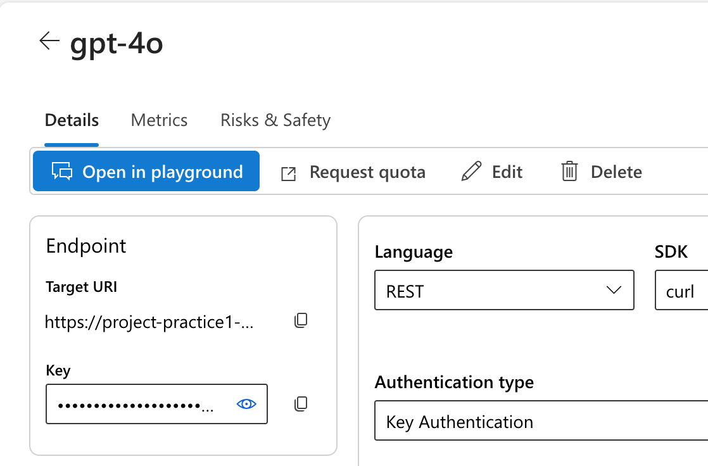
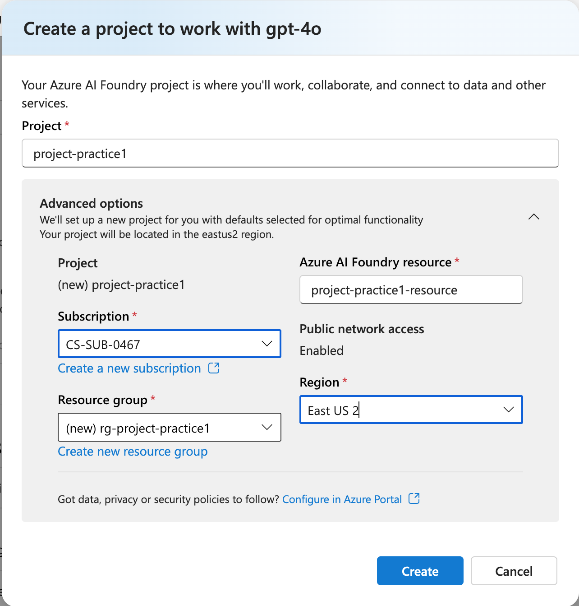
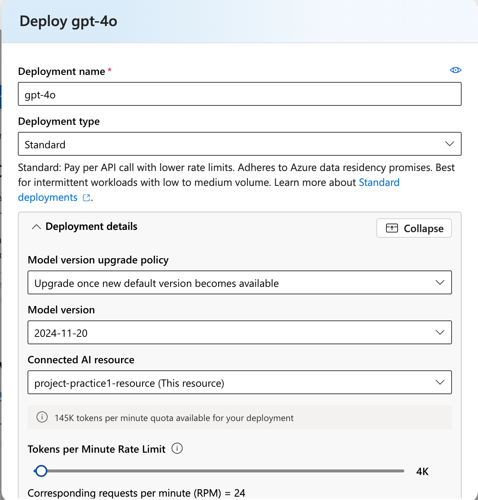
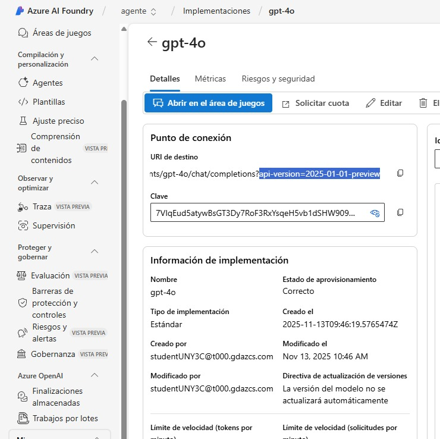
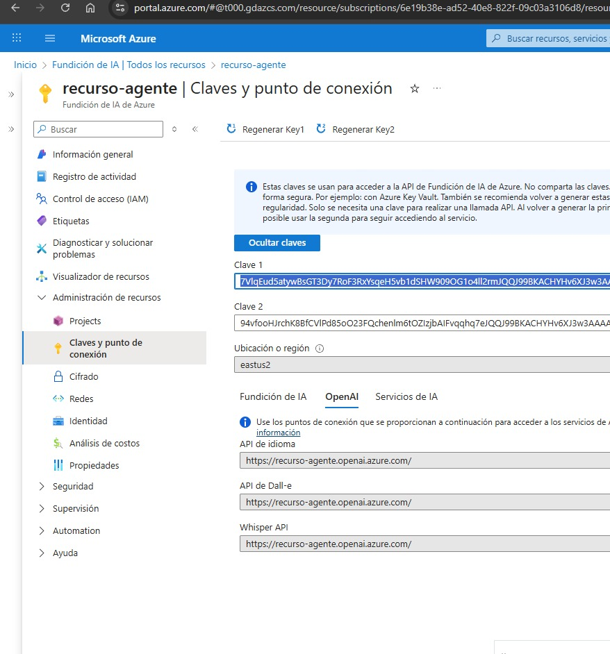
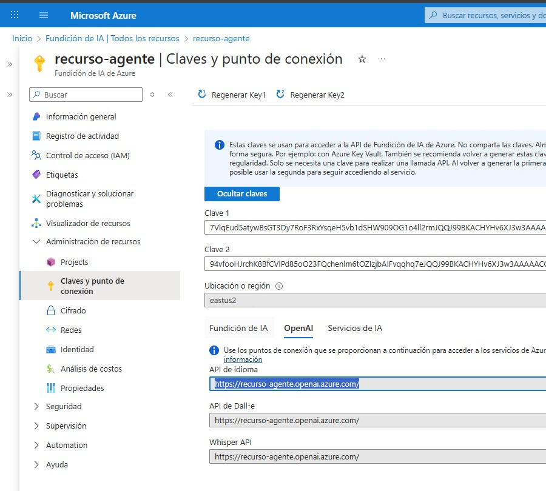

# 💬 Chat Application with Azure AI Foundry (GPT-4o)

This project demonstrates how to deploy a **GPT-4o model** using **Azure AI Foundry** and create a simple **Python client application** that chats with the deployed model.

---

## 🧩 Overview

In this exercise, you will:

1. Deploy the **GPT-4o model** in Azure AI Foundry.  
2. Configure a project and model deployment.  
3. Build a **Python chat client** using the **Azure AI Foundry** and **Azure OpenAI SDKs**.  
4. Interact with your model through a command-line chat interface.  

## 1. Deploy a model in an Azure AI Foundry project
Let's start by deploying a model in an Azure AI Foundry project.

1. Open a web browser and navigate to the Azure AI Foundry portal at https://ai.azure.com and sign in
2. In the home page, in the Explore models and capabilities section, search for the **gpt-4o model**; which we'll use in our project.
3. In the search results, select the gpt-4o model to see its details, and then at the top of the page for the model, select Use this model. When prompted to create a project, enter a valid name for your project and expand Advanced options. Select Create and wait for your project to be created.

<p align="left"></p> 


After selecting **Customize**, specify the following settings for your project:

- **Azure AI Foundry resource:**  
  Provide a valid name for your Azure AI Foundry resource.
- **Subscription:**  
  `CS-SUB-0445`
- **Resource group:**  
  Create or select an existing resource group.
- **Region:**  
  Select any *AI Foundry recommended* region.

> **Note:** Some Azure AI resources are limited by regional model quotas.  
> If you encounter quota limitations later in the exercise, you may need to create the resource again in a different region.

<p align="left"></p> 

4. If prompted, deploy the gpt-4o model using the Standard deployment type and customize the deployment details to set a Tokens per minute rate limit of 5K.
 
<p align="left"></p> 
 
> **Note:** Why Azure prompts to create a project when deploying a model--> Azure AI Foundry requires a project to manage model deployments, resources, and configurations. 
If no project exists when you select **Use this model**, Azure automatically asks you to create one. 
This project acts as the workspace where the model deployment, agent configuration, and related assets will be stored.

> **Note:**  Reducing the TPM helps avoid over-using the quota available in the subscription you are using. 5,000 TPM should be sufficient for the data used in this exercise. If your available quota is lower than this, you will be able to complete the exercise but you may experience errors if the rate limit is exceeded.

5. When your project is created, the chat playground will be opened automatically so you can test your model:
6. In the Setup pane, note the name of your model deployment; which should be gpt-4o. You can confirm this by viewing the deployment in the Models and endpoints page (just open that page in the navigation pane on the left).
7. In the navigation pane on the left, select Overview to see the main page for your project; which looks like this:

## 2. Create a client application to chat with the model


### 1. Prepare the Application Configuration

1. In the **Azure AI Foundry** portal, open your project and go to the **Overview** page.
2. In the **Endpoints and keys** section:
   - Ensure the **Azure AI Foundry library** option is selected.
   - Locate your **Project endpoint** — this will be used to connect your application to your deployed model.

> **Note:** You can also use the **Azure OpenAI endpoint** if preferred.


### 2. Open Azure Cloud Shell

1. Open a new browser tab and navigate to the **Azure portal**:  https://portal.azure.com
2. Close any pop-up notifications to view the Home page.
3. Select the **Cloud Shell** button (`[>_]`) located to the right of the Azure search bar.
4. When prompted:
   - Choose **PowerShell**  
   - Select **No storage** (storage is NOT required for this exercise)

The Cloud Shell will open as a panel at the bottom of the screen.  
You can resize or maximize it for convenience.

> **Note:** If a Bash environment opens automatically, switch it to **PowerShell**.

---

### 3. Switch Cloud Shell to Classic Mode

This step is required to use the built-in code editor.

1. In the Cloud Shell toolbar, open the **Settings** menu.
2. Select **Go to Classic version**.
3. Confirm that Cloud Shell is now in classic mode before continuing.

---

### 4. Clone the Code Repository

In the Cloud Shell terminal, enter the following commands:

```bash
rm -r mslearn-ai-foundry -f
git clone https://github.com/microsoftlearning/mslearn-ai-studio mslearn-ai-foundry
```

## 4. variables de entorno

1. MODEL_DEPLOYMENT


2. OPENAI_API_VERSION



## RESOURCE DATA

3. AZURE_OPENAI_KEY



4. AZURE_OPENAI_ENDPOINT




