# 💬 Create a generative AI app that uses your own data


### 1. Create an Azure AI Foundry hub and project

Before connecting from your local app, you need a **project** in Azure AI Foundry.  

1. Open a web browser and navigate to the Azure AI Foundry portal at https://ai.azure.com.
2. Go to [https://ai.azure.com/managementCenter/allResources](https://ai.azure.com/managementCenter/allResources).  
3. Click **Create new**.  
4. In the **Create project** wizard, select to create a new **AI hub resource**. 
   - **Azure AI Foundry resource** *(Recommended)*  
     > This option unifies setup, model access, and management in a single resource for agents, models, and tools.  
   - (Optional) Choose **AI Hub resource** only for advanced ML workflows such as custom model training or fine-tuning.  
 

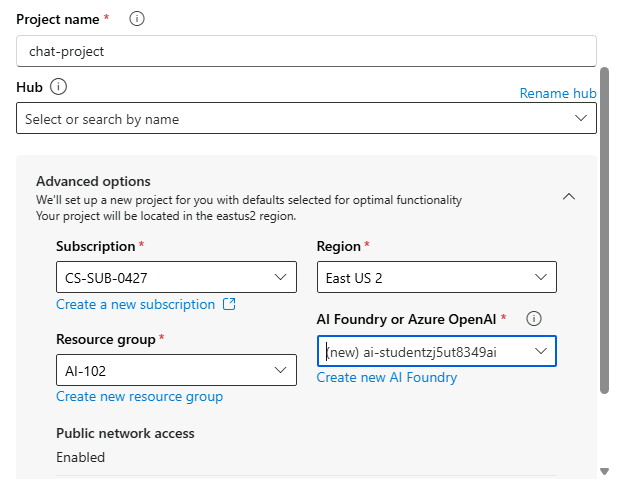

5. Click **Next** and fill in the following details:
   - **Project name:** e.g. `modelo-gpt4`
   - **Subscription:** select your available Azure subscription  
   - **Resource group:** create or select one  
   - **Region:** choose a recommended AI Foundry region  
6. Confirm the configuration and click **Create project**.

After the project is created, you’ll be redirected to its **Overview** page, where you can:
- View your **Project Endpoint**
- Access your **Keys**
- Deploy or connect models (like GPT-4o) to this project  


---

> 🧠 **Note:**  
> In Azure AI Foundry, a **Hub** is the *main workspace* that organizes and governs your AI resources — models, data connections, security policies, and teams.  
> Each **Project** lives inside a Hub and is focused on a specific use case (for example, a chatbot or a copilot).  
>  
> In practice:
> ```
> AI Hub (e.g. "student-hub-001")
> │
> └── chat-project
>      ├── Model: GPT-4o
>      ├── Endpoint: https://your-hub.openai.azure.com/
>      ├── API Key: (used by your local client)
> ```
> The Hub centralizes governance and access, while each Project handles its own model deployments and configurations.


### 2. Deploy Models

Once your Azure AI Foundry project is created, you need to **deploy the models** that will power your solution.

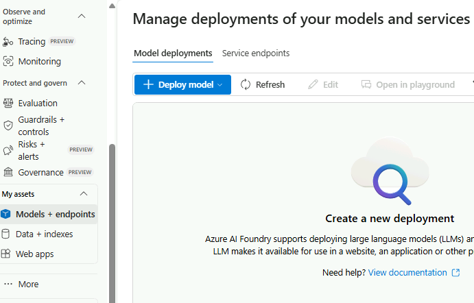


You will use **two types of models** within your Azure AI Foundry project:

1. **Embedding model**  
   Converts or *vectorizes* text data into numerical embeddings.  
   These embeddings are essential for indexing, semantic search, and retrieval-augmented generation (RAG) pipelines.  
   > Example: `text-embedding-ada-002`

2. **Generative model**  
   Generates coherent, context-aware natural language responses based on user input and retrieved data.  
   > Example: `gpt-4o` or another GPT-4 family model available in your region.


#### 1. Deploy the Embedding Model

You’ll first deploy an **embedding model**, which is used to convert or *vectorize* text into numerical embeddings for indexing, semantic search, and retrieval-augmented generation (RAG) workflows.

> Recommended model: `text-embedding-ada-002`

1. From your project’s **Overview** page in Azure AI Foundry, navigate to **Model catalog**.  
2. Search for **text-embedding-ada-002** and click **Use this model**.  
3. In the **Deploy model** wizard, select **Customize** and configure the following settings:

   | Setting | Value |
   |----------|-------|
   | **Deployment name** | A valid name (e.g., `text-embedding-deploy`) |
   | **Deployment type** | Standard |
   | **Model version** | Use default version |
   | **Tokens per minute rate limit** | 10K |
   | **Content filter** | Default |
   | **Enable dynamic quota** | Disabled |

4. Click **Deploy** and wait for the status to show **Succeeded**.

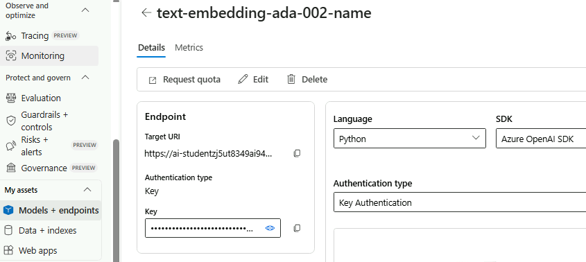

---

#### 2. Deploy the Generative Model (GPT-4o)

Next, deploy a **generative model** to generate natural language responses based on user input and retrieved data.

> Recommended model: `gpt-4o` (or another GPT-4 family model available in your region)

1. Return to the **Models + endpoints** page in your Azure AI Foundry project.  
2. Search for **gpt-4o** and select **Use this model**.  
3. In the **Deploy model** wizard, configure the following settings:

   | Setting | Value |
   |----------|-------|
   | **Deployment name** | A valid name (e.g., `gpt-4o-deploy`) |
   | **Deployment type** | Standard |
   | **Model version** | Use default version |
   | **Tokens per minute rate limit** | 10K |
   | **Content filter** | Default |
   | **Enable dynamic quota** | Disabled |

4. Click **Deploy** and wait for the deployment to complete.

Once both deployments succeed, you’ll see them listed under **Models and endpoints** in your project.  
Take note of each **deployment name**, as you’ll use these later in your Python client to connect and query the models.

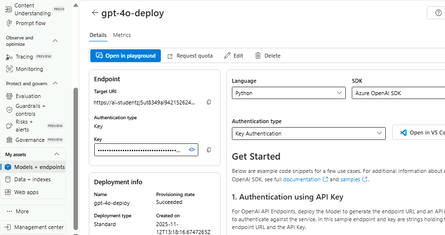


### 3. Add data to your project


In Azure AI Foundry portal, in your project, in the navigation pane on the left, under My assets, select the Data + indexes page.

<p align="center">
  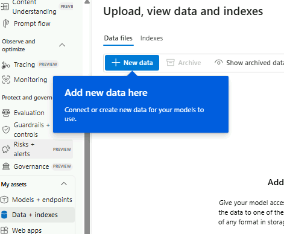
  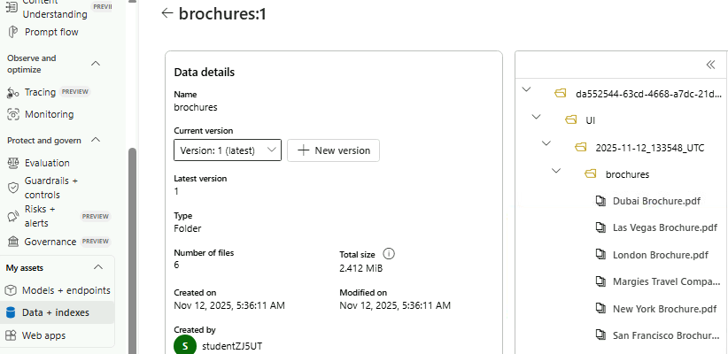
</p>


### 4. Create an Index for Your Data

Now that you’ve added a data source to your project, you can create an **index** in your Azure AI Search resource.  
This index enables fast semantic search and retrieval for RAG (Retrieval-Augmented Generation) applications.


1. In the **Azure AI Foundry portal**, open your project.  
2. In the navigation pane on the left, under **My assets**, select the **Data + indexes** page.  
3. Go to the **Indexes** tab and click **+ Add index**.  
4. Configure the index with the following settings:

#### 📂 Source location

| Setting | Value |
|----------|-------|
| **Data source** | Data in Azure AI Foundry |
| **Select data source** | Choose the *brochures* data source |

#### ⚙️ Index configuration

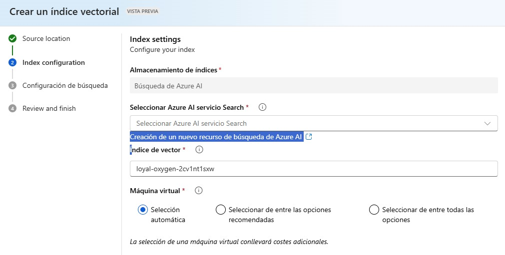

| Setting | Value |
|----------|-------|
| **Select Azure AI Search service** | Create a new Azure AI Search resource |
| **Subscription** | `CS-SUB-0427` |
| **Resource group** | `AI-102` |
| **Service name** | A valid name for your AI Search resource |
| **Location** | The same region as your AI Hub |
| **Pricing tier** | Basic |

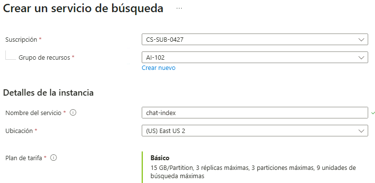


> ⏳ Wait for the **Azure AI Search** resource to finish provisioning.

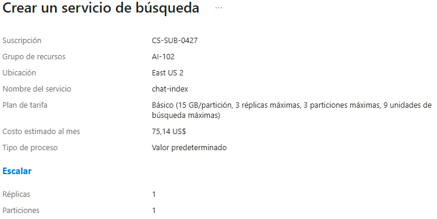

5. Once created, return to **Azure AI Foundry**, select **Connect other Azure AI Search resource**, and connect to the new AI Search resource.  

#### 🧭 Vector Index Settings

| Setting | Value |
|----------|-------|
| **Vector index name** | `brochures-index` |
| **Virtual machine** | Auto select |
| **Vector settings** | Enable *Vector search* for this search resource |
| **Azure OpenAI connection** | Select the default Azure OpenAI resource for your Hub |
| **Embedding model** | `text-embedding-a


### variables entorno

In the configuration file, replace the following placeholders:

your_openai_endpoint: The Open AI endpoint from your project's Overview page in the Azure AI Foundry portal (be sure to select the Azure OpenAI capability tab, not the Azure AI Inference or Azure AI Services capability).

your_openai_api_key The Open AI API key from your project's Overview page in the Azure AI Foundry portal (be sure to select the Azure OpenAI capability tab, not the Azure AI Inference or Azure AI Services capability).

your_chat_model: The name you assigned to your gpt-4o model deployment, from the Models + endpoints page in the Azure AI Foundry portal (the default name is gpt-4o).

your_embedding_model: The name you assigned to your text-embedding-ada-002 model deployment, from the Models + endpoints page in the Azure AI Foundry portal (the default name is text-embedding-ada-002).

your_search_endpoint: The URL for your Azure AI Search resource. You'll find this in the Management center in the Azure AI Foundry portal.

your_search_api_key: The API key for your Azure AI Search resource. You'll find this in the Management center in the Azure AI Foundry portal.

your_index: Replace with your index name from the Data + indexes page for your project in the Azure AI Foundry portal (it should be brochures-index).


**1. AZURE_OPEN_AI_ENDPOINT**


**2. AZURE_OPEN_AI_KEY**

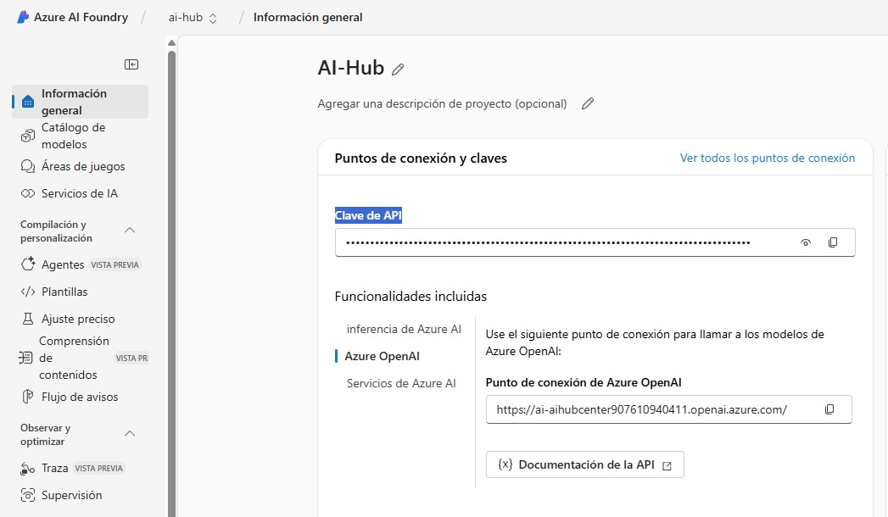

**3. CHAT_MODEL**


**4. EMBEDDING_MODEL**

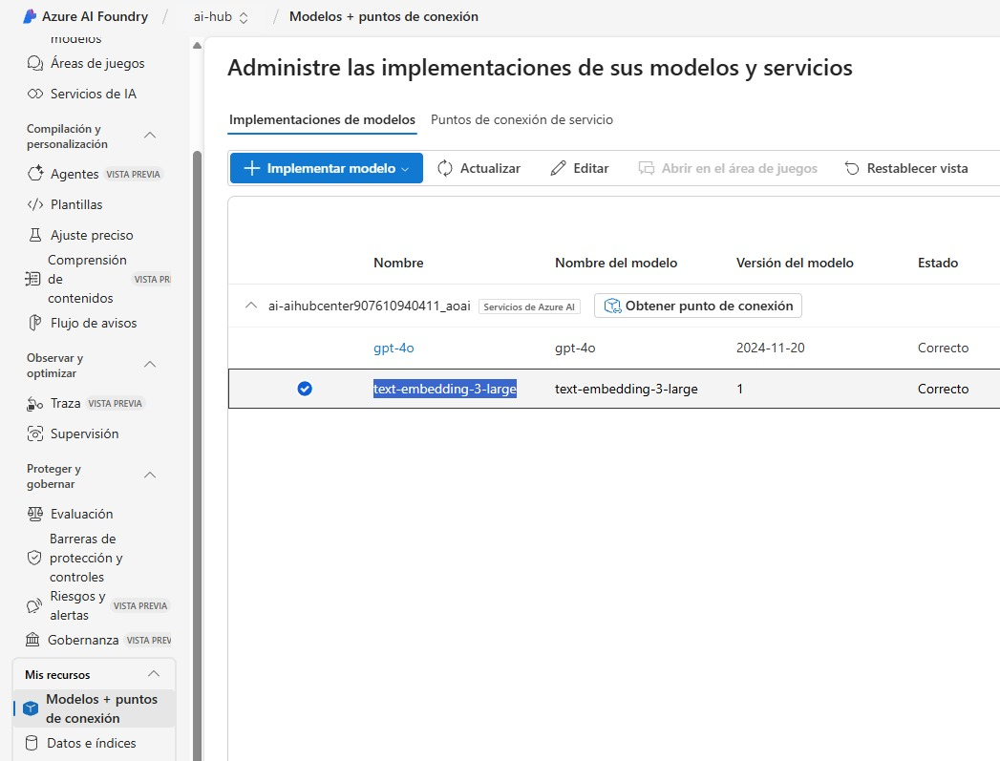

**5. SEARCH_ENDPOINT**

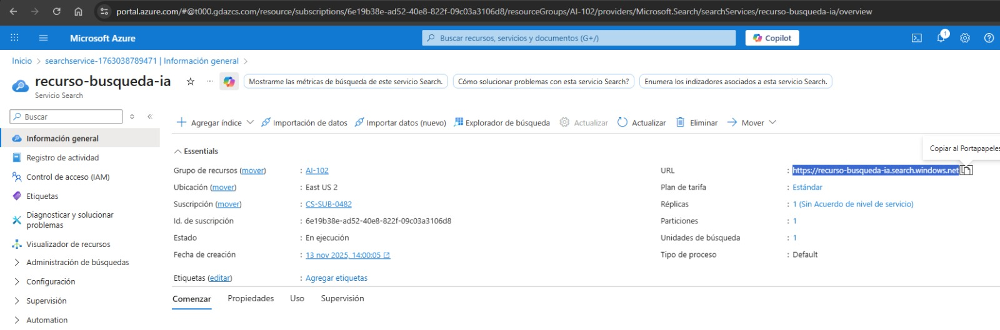

**6. SEARCH_KEY**

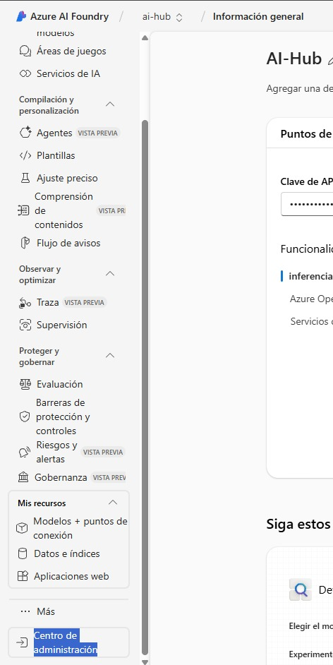
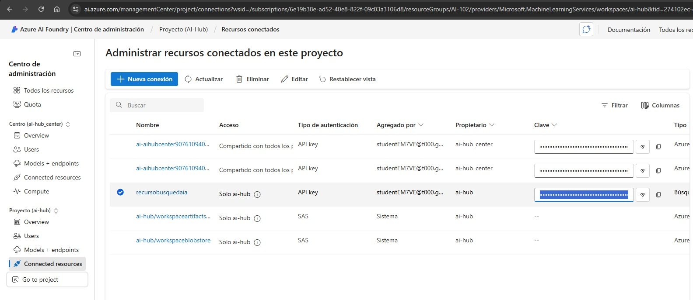
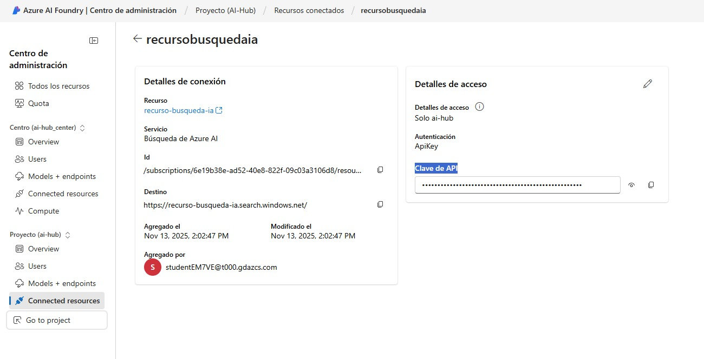

**7. INDEX_NAME**

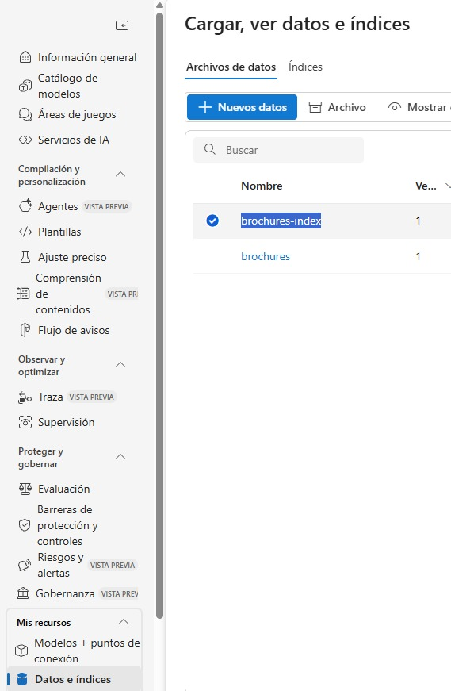

