# Evaluate Generative AI Model Performance

This exercise guides you through manually and automatically evaluating the performance of generative AI models in Azure AI Foundry using gpt-4o and gpt-4o-mini.

## 1. Create an Azure AI Foundry Hub and Project

In Azure AI Foundry, every project must belong to an AI Hub. An AI Hub acts as a central control plane that manages:
- model deployments  
- datasets  
- evaluation jobs  
- resource connections  
- monitoring and observability  

The steps below initialize that environment.

---

1. Go to https://ai.azure.com and sign in with the provided credentials. Close any initial help or quick start panes.
2. Navigate to Management Center → All resources and select “Create new → AI hub”.
    - https://ai.azure.com/managementCenter/allResources

    
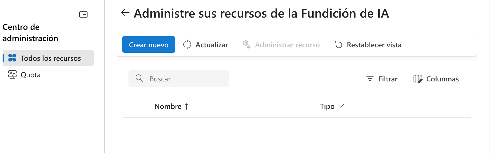

    
3. In the creation wizard:

    

   - Enter a valid project name.
   - Select “Create a new hub” and rename it.
   - Configure:
     - Subscription: CS-SUB-0445
     - Resource group: AI-102
     - Region: any recommended region

    
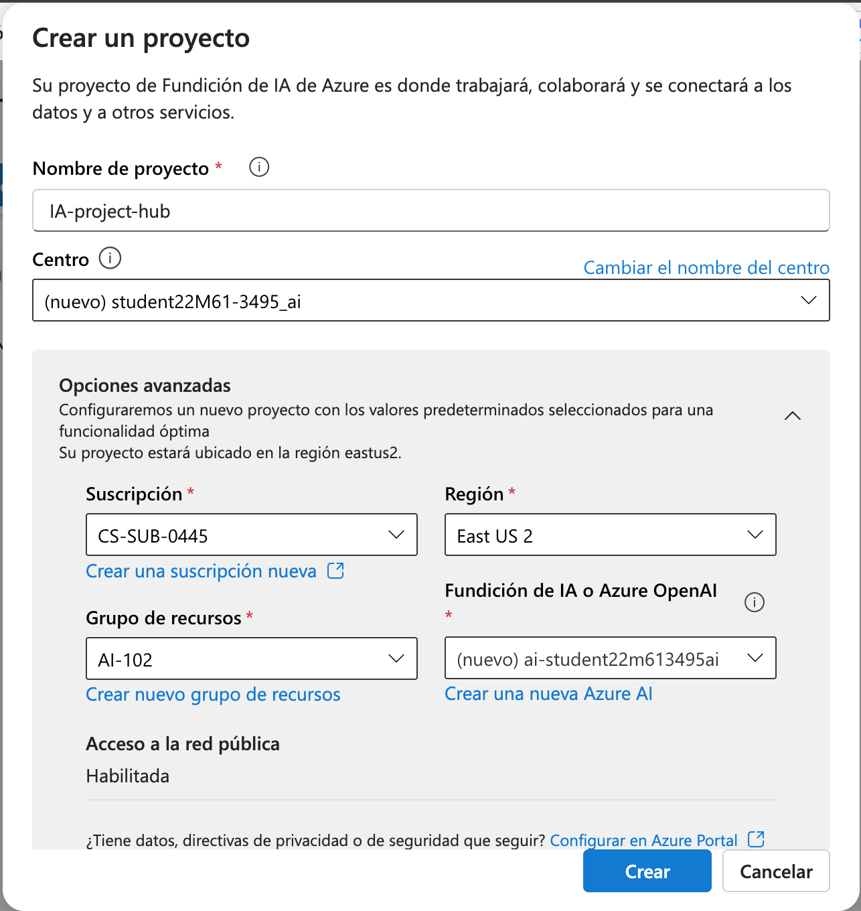

    - In this screen, you are creating a new Azure AI Foundry project, which serves as the workspace where models, datasets, evaluations, and AI workflows will live.
    - Azure automatically creates (or lets you rename) an AI Hub, which acts as the central control plane for:
        - organizing AI resources
        - securely storing connections
        - providing shared infrastructure for models and evaluations
        - enabling collaboration within the workspace
        - This is required because every Azure AI Foundry project must be attached to a hub.

4. Create the project and wait until deployment is complete.

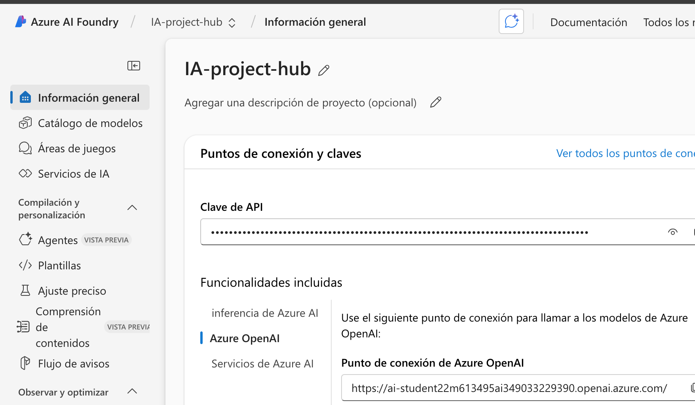

- API Key: an API key associated with your Azure OpenAI resource is displayed. This:
    - authenticates calls to deployed models
    - is used for programmatic access from notebooks, scripts, or applications

- Azure OpenAI Endpoint: this endpoint is required for:
    - model deployment, inference calls, automated evaluations, integration into pipelines

### Why these settings matter
- The **hub** aggregates all AI operations: model inference, quotas, endpoints, monitoring, and shared assets.
- The **region** determines availability and latency for Azure AI services.
- The **resource group** organizes all Azure assets, simplifying cleanup.
- The **subscription** defines quota limits for model deployments, evaluations, and token usage.

### Conclusion

Across these steps, you have completed the entire environment setup required to work with Azure AI Foundry. Specifically, you have:

1. Provisioned a full AI workspace
- Project
- AI Hub
- Azure AI/OpenAI resource. This establishes the foundational infrastructure for hosting and serving generative AI models.

2. Configured the operational context
By specifying subscription, resource group, and region, you ensured that all components are deployed in a consistent, controlled environment.

3. Gained access to operational endpoints
The API key and endpoint shown in the last screen allow you to:
- deploy models
- run inference
- connect external tools or applications
- perform evaluations

4. Reached the point where model operations can begin
The next steps (according to the lab instructions) will involve:

- deploying gpt-4o and gpt-4o-mini
- performing manual evaluation
- running automated evaluation pipelines
- analyzing metrics such as semantic similarity, relevance, F1 score, and content safety

--- 

## 2. Deploy the Models

### Deploy gpt-4o
1. In the project, go to My assets → Models + endpoints. Select “+ Deploy model → Deploy base model”.

  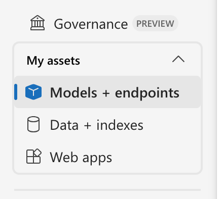
  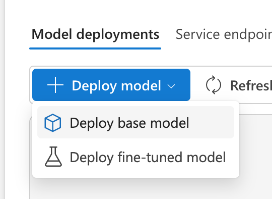

2. Search for and select gpt-4o.

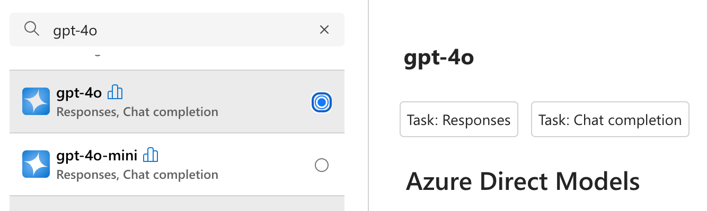

3. Configure:
   - Deployment name: valid unique name
   - Deployment type: Standard
   - Automatic version update: Enabled
   - Model version: latest available
   - Connected AI resource: your Azure OpenAI connection
   - Tokens per Minute: 50K (or the maximum available)
   - Content filter: DefaultV2

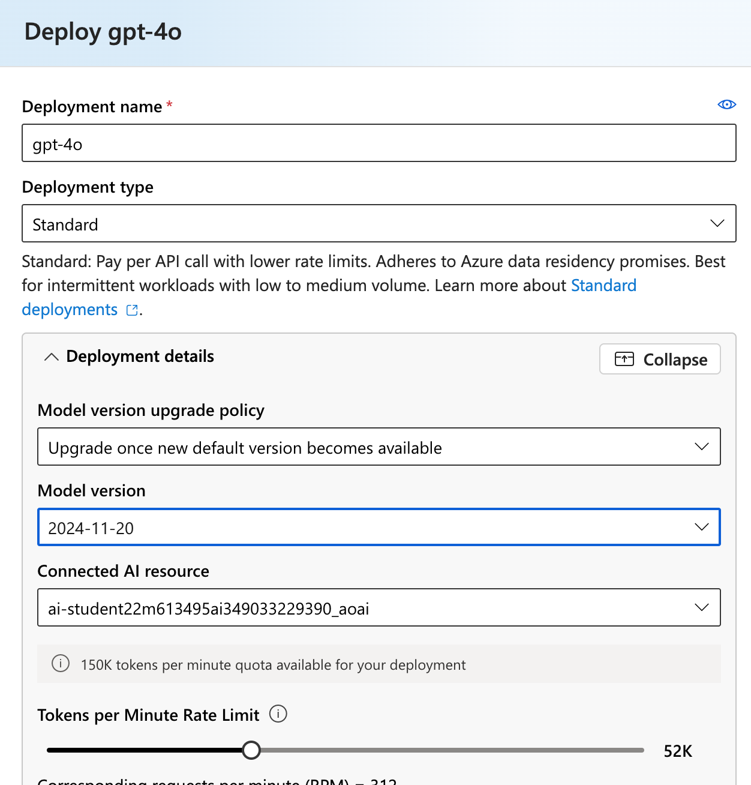

   
4. Deploy the model.

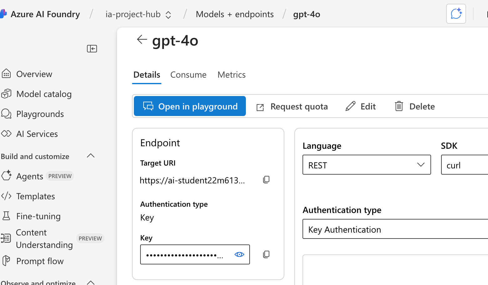

### Deploy gpt-4o-mini
Repeat the same steps to deploy gpt-4o-mini.

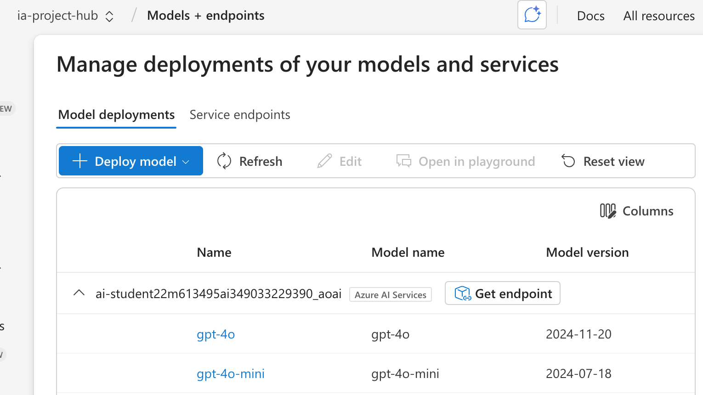

## 3. Manual Model Evaluation

1. Download the evaluation dataset:
   https://raw.githubusercontent.com/MicrosoftLearning/mslearn-ai-studio/refs/heads/main/data/travel_evaluation_data.jsonl
2. In Azure AI Foundry, go to Protect and govern → Evaluation. In the Manual evaluations tab, select “+ New manual evaluation”.

  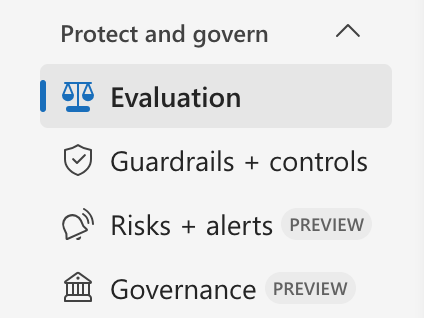
  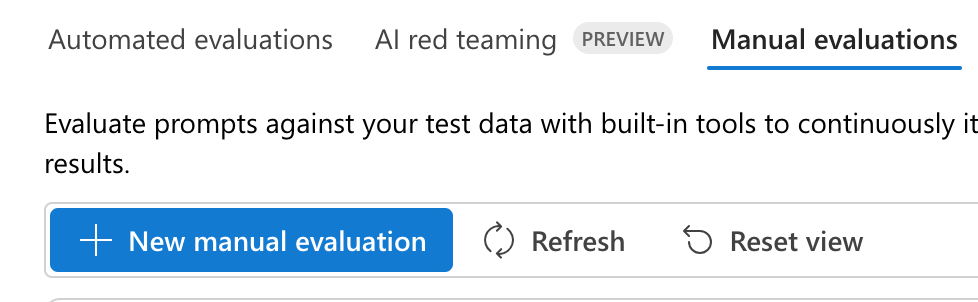

3. Select your gpt-4o deployment.Set the system message:
   Assist users with travel-related inquiries, offering tips, advice, and recommendations as a knowledgeable travel agent.

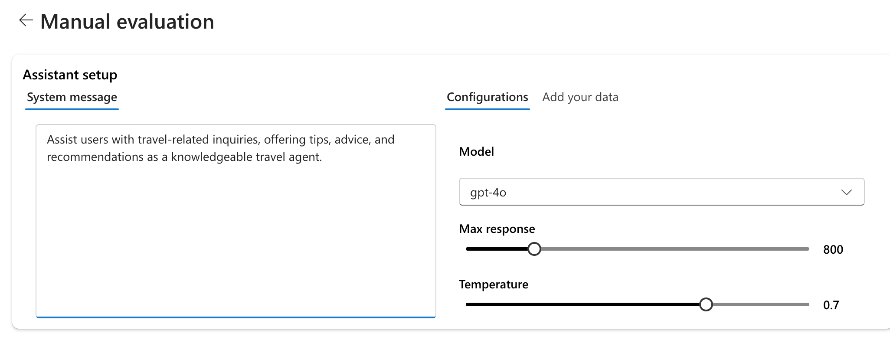

   
5. In the Manual evaluation result section, select Import test data and upload the travel_evaluation_data.jsonl file you downloaded previously; scrolling down to map the dataset fields as follows:

- Input: Question
- Expected response: ExpectedResponse
- Import the .jsonl file and map the fields:

  
  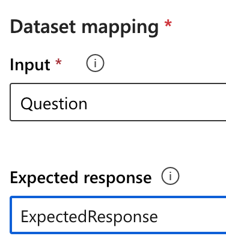

6. Run the evaluation to generate the Output column.

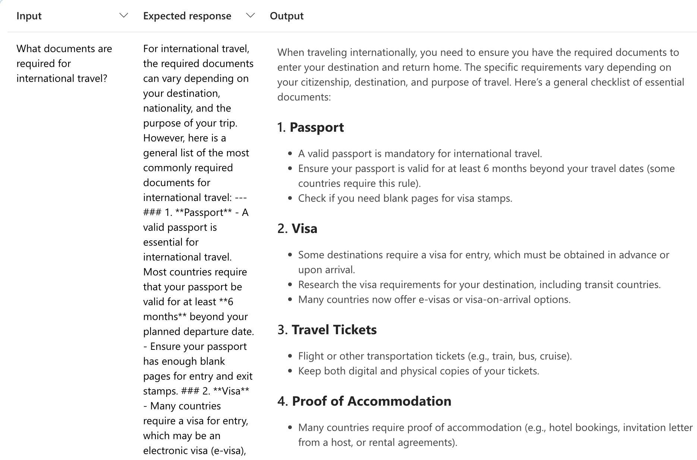

7. Review each response and score it with 👍 / 👎.
8. Save the results.

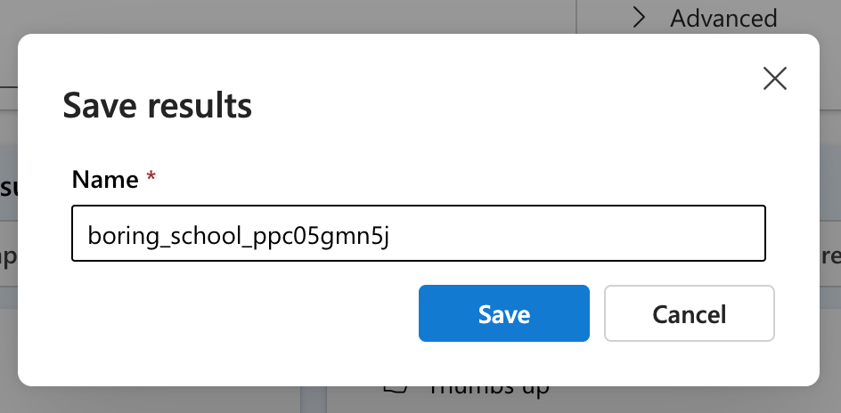

## 4. Automated Model Evaluation

1. In the Evaluation page, open the Automated evaluations tab.
2. Select “Create a new evaluation → Evaluate a model”.

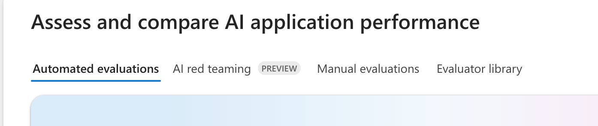

3. Choose the previously uploaded dataset.
4. Select gpt-4o-mini as the model.
5. Use the same system message:
   Assist users with travel-related inquiries, offering tips, advice, and recommendations as a knowledgeable travel agent.

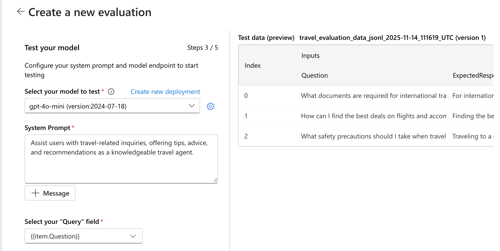

   
6. Set Query: {{item.question}}

### Add Evaluators

#### Model scorer (Semantic similarity)
- Criteria: Semantic_similarity
- Grade with: gpt-4o
- Output: {{sample.output_text}}
- Ground truth: {{item.ExpectedResponse}}

#### Likert-scale evaluator (Relevance)
- Criteria: Relevance
- Grade with: gpt-4o
- Query: {{item.question}}

#### Text similarity (F1 Score)
- Criteria: F1_Score
- Ground truth: {{item.ExpectedResponse}}

#### Hateful and unfair content
- Criteria: Hate_and_unfairness
- Query: {{item.question}}

7. Review configuration, assign a name, and submit the evaluation.
8. Wait for completion and review the metrics.
9. Open the Data tab to view per-item scores and reasoning generated by the evaluator model.

## 5. Clean Up Resources

1. Go to https://portal.azure.com.
2. Navigate to Resource groups.
3. Select the resource group used during the exercise.
4. Click “Delete resource group”.
5. Confirm by entering the resource group name.

## Outcome

By completing this exercise, you will have deployed generative AI models, run manual and automated evaluations, analyzed metrics such as semantic similarity, relevance, and F1 score, reviewed harmful-content detection, and cleaned up all Azure resources to avoid additional costs.
