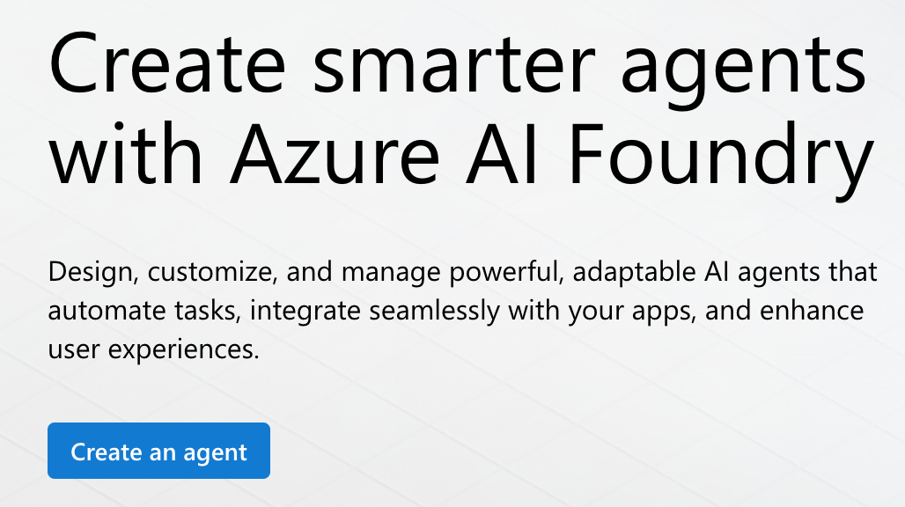
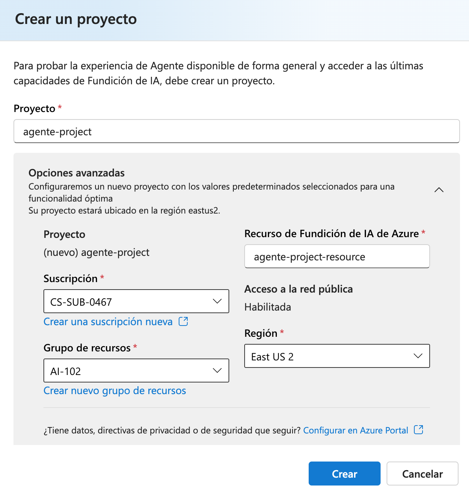
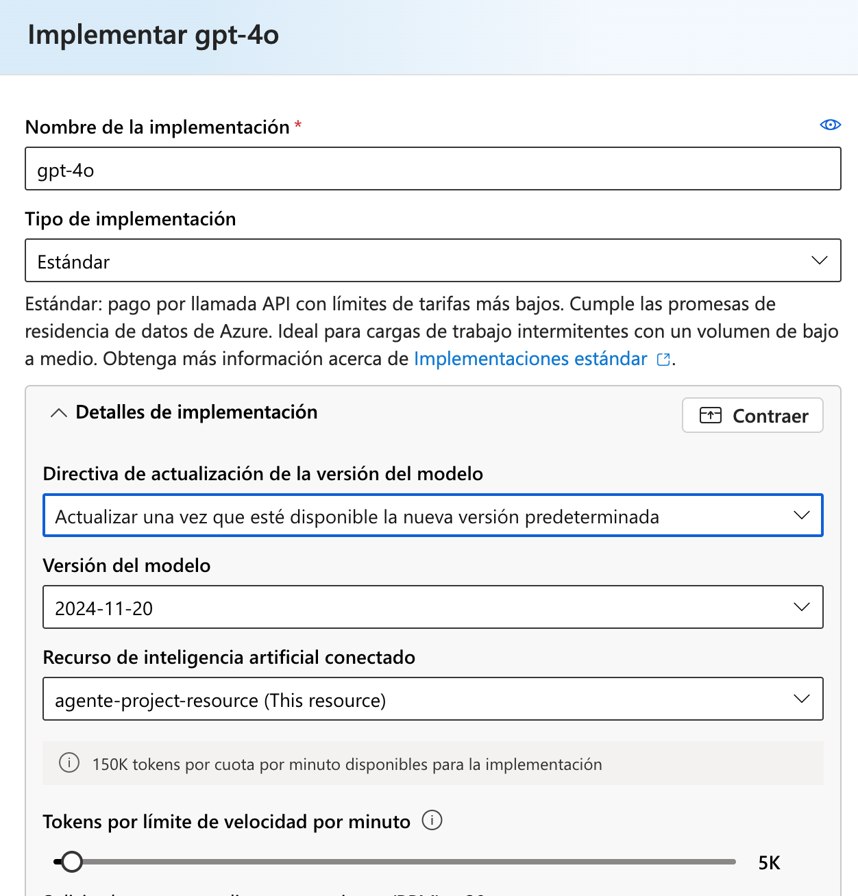
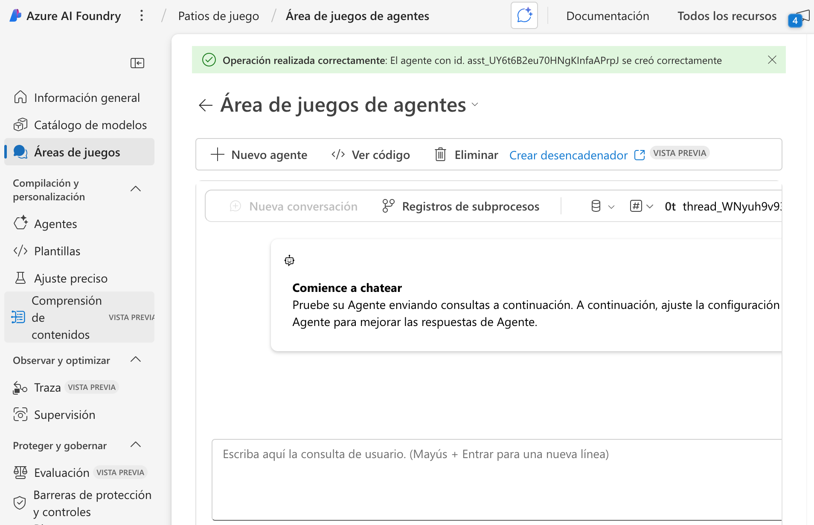
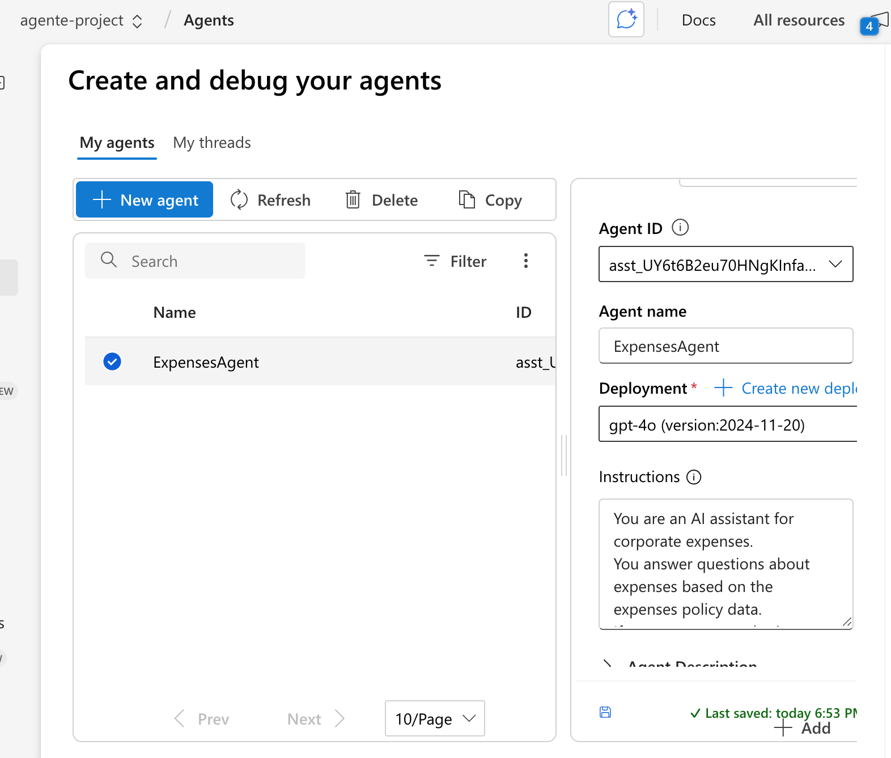
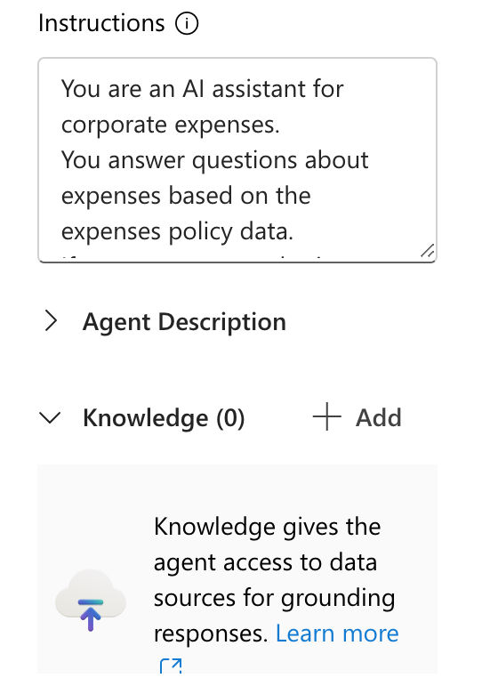
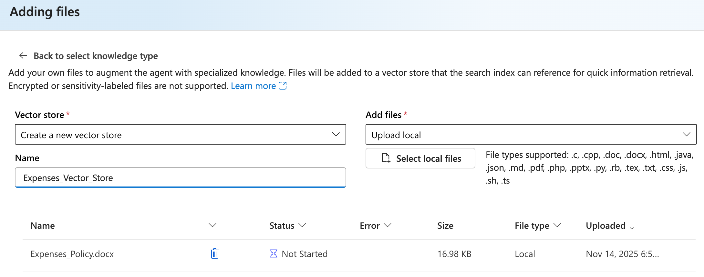
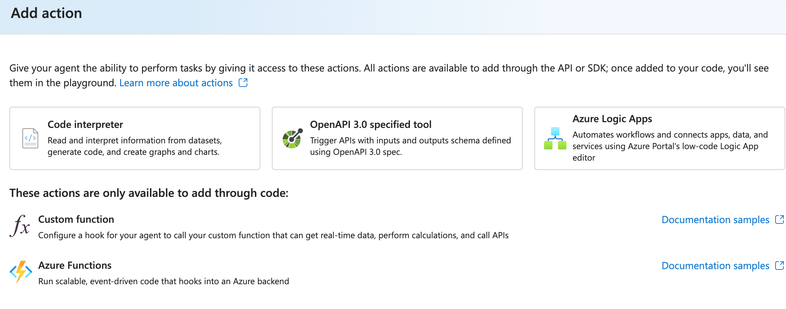
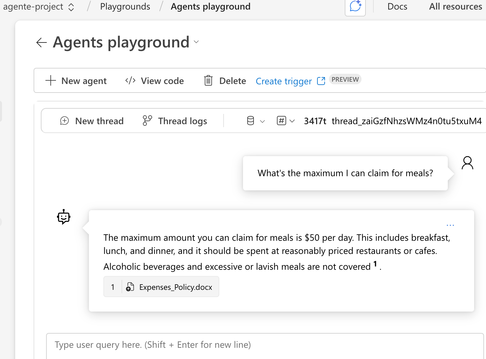

# Explore AI Agent Development

This project demonstrates how to build, configure, and test an AI Agent using the Azure AI Agent service in Azure AI Foundry. The agent assists employees with corporate expense claims by grounding its responses in a policy document and generating claim files through the code interpreter.

> **Note:** Some features used in this exercise are in preview or evolving. You may encounter errors or unexpected behavior.

---

## 1. Create an Azure AI Foundry Project and Agent

## Create the Project
1. Open https://ai.azure.com and sign in 
2. On the home page, select **Create an agent**.

<p align="left"></p>

3. Enter a valid project name.
4. Expand **Advanced options** and configure:
   - **Azure AI Foundry resource:** choose a valid name  
   - **Subscription:** `CS-SUB-0429`
   - **Resource group:** `AI-102`
   - **Region:** any recommended region  

<p align="left"></p>

5. Select **Create**.

6. If prompted to deploy the `gpt-4o` model:
   - Deployment type: **Standard**
   - Tokens per minute: **5K** (or the maximum available)

<p align="left"></p>

7. When your project is created, the Agents playground will be opened automatically so you can select or deploy a model:

<p align="left"></p>


---

### Notes: Automatic Resource Creation When Creating an Agent

When you create an AI Agent for the first time in Azure AI Foundry, the platform automatically provisions the required infrastructure if it does not already exist.

If you click **Create an agent** and no project or Azure OpenAI resource is available yet, Azure will automatically create:

- **A new Project** -> This serves as the workspace that stores agents, models, vector stores, evaluations, and configuration.
- **A new Azure OpenAI Resource**  -> This is the backend service where the model is hosted, deployed, and executed.

- **A Base Model Deployment (gpt-4o or gpt-4o-mini)**  -> Azure deploys a default model so the agent has a working LLM available immediately.

This automation ensures that first-time users can start building agents without manually creating or configuring backend resources. Once the project is created, all future agents and deployments will reuse the connected Azure OpenAI resource unless specified otherwise.

## 2. Create the Agent


1. Return to the browser tab containing the Foundry Agents playground, and find the Setup pane (it may be to the side or below the chat window). Set the Agent name to **ExpensesAgent**, ensure that the gpt-4o model deployment you created previously is selected, and set the Instructions to:

```bash
You are an AI assistant for corporate expenses.
You answer questions about expenses based on the expenses policy data.
If a user wants to submit an expense claim, you get their email address, a description of the claim, and the amount to be claimed and write the claim details to a text file that the user can download.
```

<p align="left"></p>

### Notes
When you create an agent in Azure AI Foundry, the system automatically assigns a default, auto-generated name (for example, “Agent294”). This is expected behavior.

2. Further down in the Setup pane, next to the Knowledge header, select + Add. Then in the Add knowledge dialog box, select Files.

<p align="left"></p>

3. In the Adding files dialog box, create a new vector store named Expenses_Vector_Store, uploading and saving the Expenses_policy.docx. In the Setup pane, in the Knowledge section, verify that Expenses_Vector_Store is listed and shown as containing 1 file.

<p align="left"></p> 

4. Below the Knowledge section, next to Actions, select + Add. Then in the Add action dialog box, select Code interpreter and then select Save (you do not need to upload any files for the code interpreter).

<p align="left"></p> 

Your agent will use the document you uploaded as its knowledge source to ground its responses (in other words, it will answer questions based on the contents of this document). It will use the code interpreter tool as required to perform actions by generating and running its own Python code.


## 3. Test your agent


1. In the playground chat entry, enter the prompt: What's the maximum I can claim for meals? and review the agent's response - which should be based on information in the expenses policy document you added as knowledge to the agent setup.

<p align="left"></p> 


Note: If the agent fails to respond because the rate limit is exceeded. Wait a few seconds and try again. If there is insufficient quota available in your subscription, the model may not be able to respond. If the problem persists, try to increase the quota for your model on the Models + endpoints page.

2. Try the following follow-up prompt: **I'd like to submit a claim for a meal.** and review the response. The agent should ask you for the required information to submit a claim.

```bash
Great! To submit your meal claim, I'll need the following details:

Your email address (so we can associate the claim with you).
Description of the claim (e.g., breakfast, lunch, or dinner along with relevant context like location or purpose).
Expense amount (please keep within the maximum meal claim of $50 per day).

Please provide these details, and I'll prepare the claim for you!
```

3. Provide the agent with an email address; for example, **fred@contoso.com.** The agent should acknowledge the response and request the remaining information required for the expense claim (description and amount)

```bash
Thank you for providing your email address. Now, could you please provide the description of the expense along with the amount you are claiming? For example: "Lunch during meeting with client - $25".
```

4. Submit a prompt that describes the claim and the amount; for example, Breakfast cost me $20.

```bash
Your expense claim has been prepared. You can download it using the link below:
Download Expense Claim
```

5. The agent should use the code interpreter to prepare the expense claim text file, and provide a link so you can download it. Download and open the text document to see the expense claim details.

