# 🧪 Lab: Use a custom function in an AI agent

Este laboratorio guía el desarrollo de un **AI Agent** capaz de analizar datos y generar visualizaciones utilizando **Azure AI Agent Service** y el **Code Interpreter Tool**.  
El agente ejecutará código Python de forma dinámica para procesar datos y responder a consultas del usuario.

---

## 1. Create an Azure AI Foundry project

1. Open a web browser and navigate to the Azure AI Foundry portal at https://ai.azure.com.
2. In the home page, select **Create an agent**. 

<p align="left">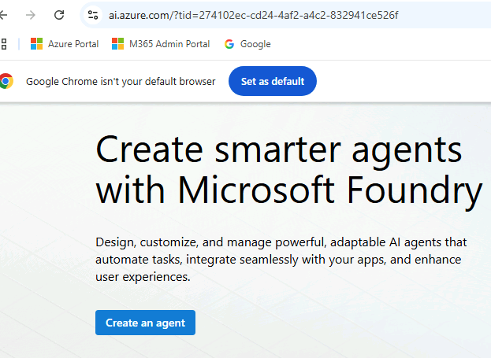</p> 

3. When prompted to create a project, enter a valid name for your project and expand Advanced options.
4. Confirm the following settings for your project:

* Some Azure AI resources are constrained by regional model quotas. In the event of a quota limit being exceeded later in the exercise, there's a possibility you may need to create another resource in a different region.
   - **Azure AI Foundry resource:** A valid name for your Azure AI Foundry resource 
   - **Subscription:** Tu suscripción del laboratorio , CS-SUB-0417
   - **Resource group:** AI-102  
   - **Region:** Select any AI Foundry recommended*

<p align="left">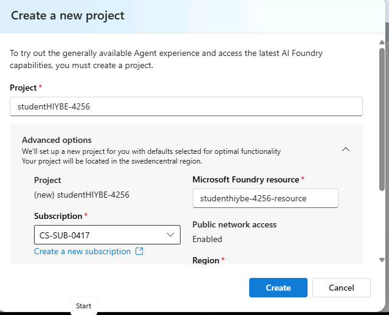</p> 

5. If prompted, deploy a **gpt-4o** model using either the Global Standard or Standard deployment option (depending on your quota availability).

<div style="display: flex; gap: 10px;">
  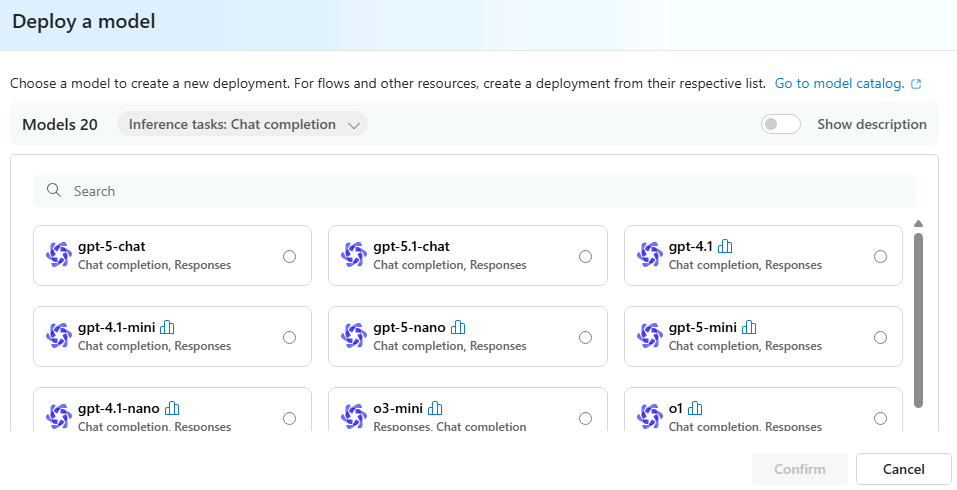
  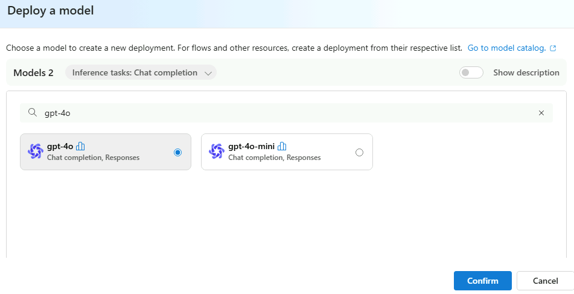
  
</div>


6. When your project is created, the Agents playground will be opened.

<div style="display: flex; gap: 10px;">
  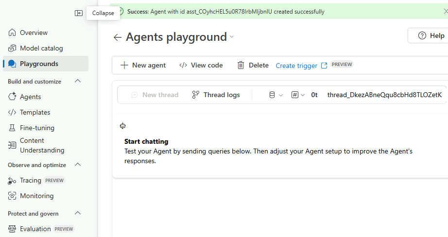
  
</div>


7. In the navigation pane on the left, select Overview to see the main page for your project; which looks like this:

<p align="left">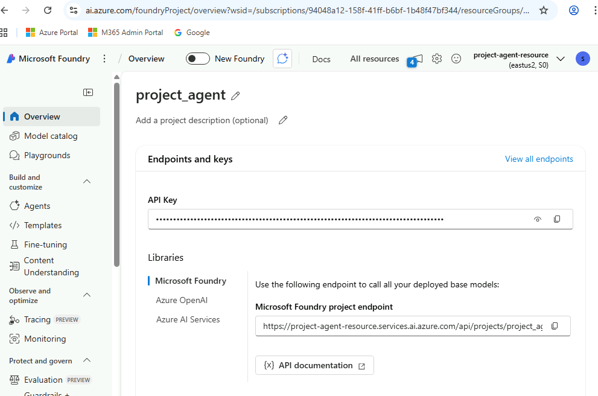</p> 

8. Copy the Azure AI Foundry project endpoint values to a notepad, as you'll use them to connect to your project in a client application


## 2. Develop an agent that uses function tools

### Clone the repo containing the application code

1. Open a new browser tab (keeping the Azure AI Foundry portal open in the existing tab). Then in the new tab, browse to the **Azure portal** at https://portal.azure.com; signing in with your Azure credentials if prompted.
2. Abre **Azure Cloud Shell** (PowerShell).  Use the [>_] button to the right of the search bar at the top of the page to create a new Cloud Shell in the Azure portal, selecting a PowerShell environment with no storage in your subscription.
3. In the cloud shell pane, enter the following commands to clone the GitHub repo containing the code files for this exercise (type the command, or copy it to the clipboard and then right-click in the command line and paste as plain text):

```bash
rm -r ai-agents -f
git clone https://github.com/MicrosoftLearning/mslearn-ai-agents ai-agents
```
### Configure the application settings

1. In the cloud shell command-line pane, enter the following command to install the libraries you'll use:

```bash
python -m venv labenv
./labenv/bin/Activate.ps1
pip install -r requirements.txt azure-ai-projects
```

2. Enter the following command to edit the configuration file that has been provided:

```bash
code .env
```

<p align="left">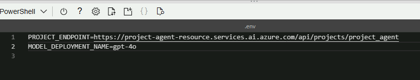</p> 

### Define a custom function

1. Enter the following command to edit the code file that has been provided for your function code:

```bash
code user_functions.py
```
### Write code to implement an agent that can use your function

1. Review the code, using the comments to understand how it:

- Adds your set of custom functions to a toolset
- Creates an agent that uses the toolset.
- Runs a thread with a prompt message from the user.
- Checks the status of the run in case there's a failure
- Retrieves the messages from the completed thread and displays the last one sent by the agent.
- Displays the conversation history
- Deletes the agent and thread when they're no longer required.

### Sign into Azure and run the app

1. Run az login 

```bash
az login
```

<p align="left">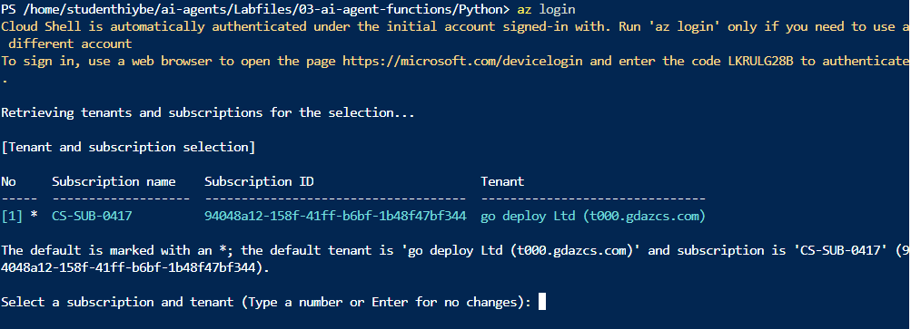</p> 

2. After you have signed in, enter the following command to run the application:

3. When prompted, enter a prompt such as:

I have a technical problem

<p align="left">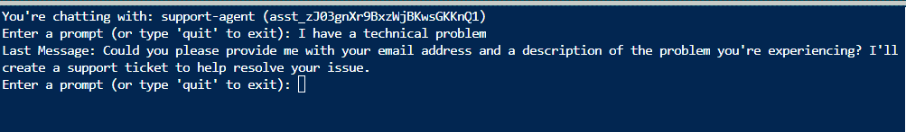</p> 

4. View the response. The agent may ask for your email address and a description of the issue. You can use any email address (for example, alex@contoso.com) and any issue description (for example my computer won't start)


5. You can continue the conversation if you like. The thread is stateful, so it retains the conversation history - meaning that the agent has the full context for each response. Enter quit when you're done.

6. Review the conversation messages that were retrieved from the thread, and the tickets that were generated.
7. The tool should have saved support tickets in the app folder. You can use the ls command to check, and then use the cat command to view the file contents, like this:


cat ticket-<ticket_num>.txt

## ✔️ Conclusiones técnicas

- **Los Azure AI Agents no soportan autenticación por clave.**  
  Solo admiten autenticación mediante **Azure Active Directory (Azure AD)**.

- Por tanto, el código únicamente puede funcionar utilizando:

  **✔️ `DefaultAzureCredential`**  
  Ideal para desarrollo local, especialmente si utilizas `az login`.

  **✔️ `ClientSecretCredential`**  
  Recomendado para entornos de **CI/CD**, servicios backend o despliegues automatizados.

## Ejecutar sin AZ LOGIN

### 1. Microsoft Entra ID (antes Azure AD)

https://portal.azure.com/#view/Microsoft_AAD_IAM/ActiveDirectoryMenuBlade/~/Overview


### 2. Crear la App Registration
Microsoft Entra ID → Registros de aplicaciones → Nuevo registro

<p align="left"></p> 

**Registrar una aplicacion**
<p align="left">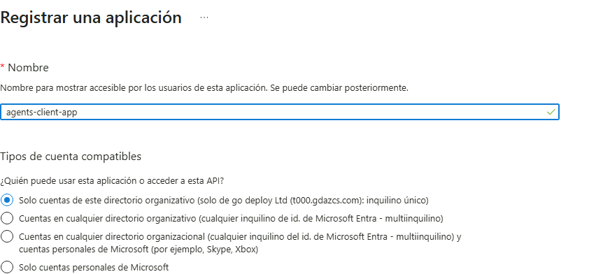</p> 

Aqui sale nuestro valor "azure_client_id"

<p align="left">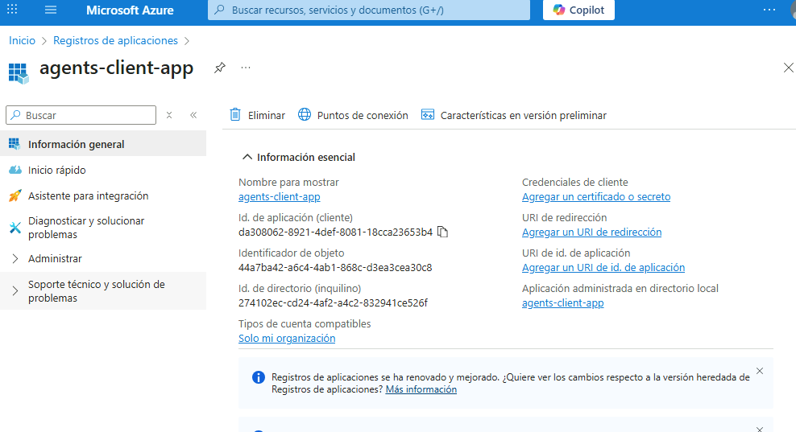</p>

- Una vez creada:
- - El Application (client) ID aparece arriba.
- - El Directory (tenant) ID aparece también aquí (mismo que antes).

### 3. Crear el Secret: AZURE_CLIENT_SECRET

https://portal.azure.com/#view/Microsoft_AAD_RegisteredApps/ApplicationMenuBlade/~/Credentials

>New client secret → Add → Copia el valor

<p align="left">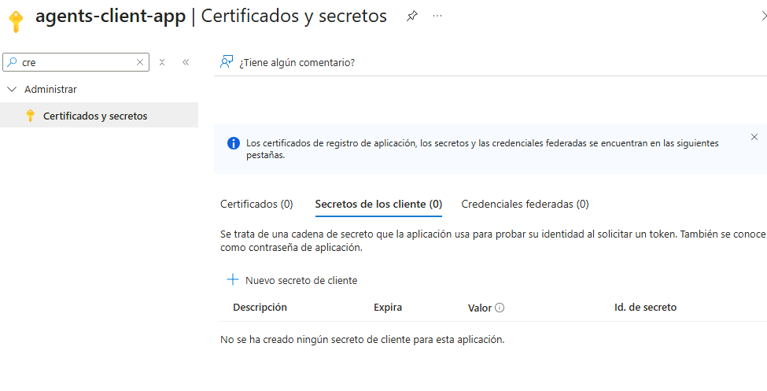</p> 

- El Valor es la clave secreta real que Azure AD usa para generar tokens.
- El Id. de secreto solo identifica el secreto dentro de Azure; no sirve para autenticación.
<p align="left">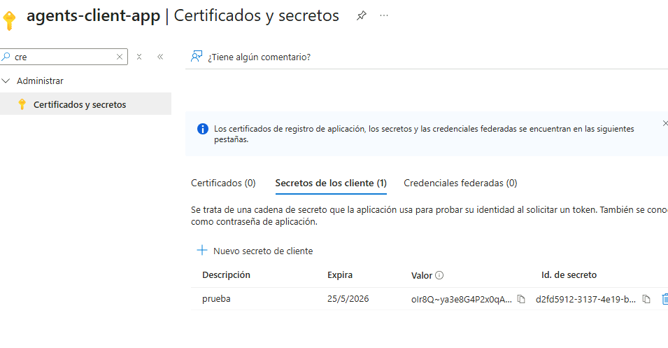</p> 

### 4. Asignar permisos (rol IAM) a la App Registration

1. Abrir los recursos
<p align="left">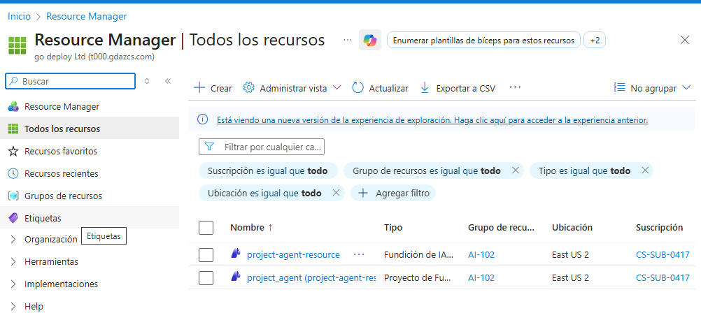</p> 

#### Identificación de recursos en Azure AI Foundry

2. Tienes dos recursos principales:

 1️⃣ `project-agent-resource`
- **Tipo:** Fundición de IA (Azure AI Services)  
- **Descripción:**  
  Este es el *recurso raíz* del Azure AI Foundry.  
  **Aquí es donde deben asignarse los permisos.**

Este recurso controla las capacidades críticas:
- Crear Agents  
- Ejecutar Agents  
- Llamar a `/assistants`  
- Crear `/runs`  
- Crear `/threads`  

👉 **Este es el recurso que actualmente está bloqueando las operaciones.**


 2️⃣ `project_agent` (dentro de `project-agent-resource`)
- **Tipo:** Proyecto de Azure AI  
- **Descripción:**  
  Este es el proyecto Foundry donde residen y se configuran los Agents, pero **no es** donde se gestionan los permisos fundamentales.


📌 **Conclusión:**  
Asigna los permisos directamente en **`project-agent-resource` (Fundición de IA)** para desbloquear todas las operaciones relacionadas con Agents y Assistants.

3. Haz clic en:
project-agent-resource (Tipo: Fundición de IA)
<p align="left">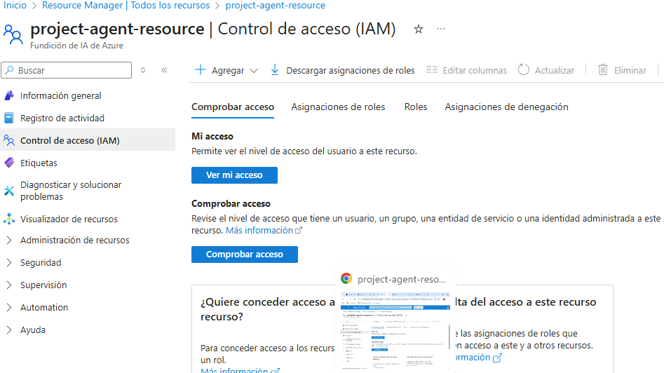</p> 


4. Ahora los pasos exactos

- Control de acceso (IAM)
- Clic en + Agregar
- Clic en Agregar asignación de rol
- Buscar el rol:
   - Azure AI Developer (recomendado)
   - Cognitive Services Contributor

- Seleccionar “Usuario, grupo o entidad de servicio”

<p align="left">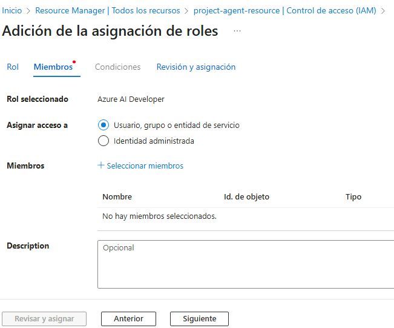</p> 

- Buscar tu App Registration: agents-client-app
<p align="left"></p> 


- Seleccionarlo y guardar


