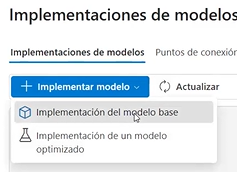
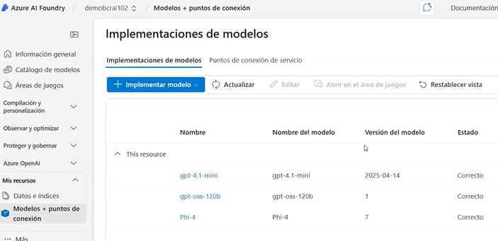
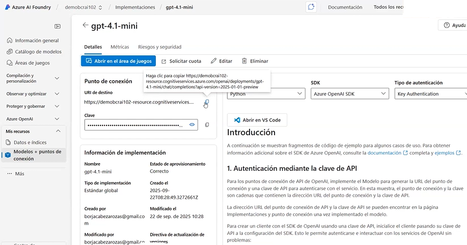

# 💬 Chat Application with Azure AI Foundry (GPT-4o)

This project demonstrates how to deploy a **GPT-4o model** using **Azure AI Foundry** and create a simple **Python client application** that chats with the deployed model.

---

## 🧩 Overview

In this exercise, you will:

1. Deploy the **GPT-4o model** in Azure AI Foundry.  
2. Configure a project and model deployment.  
3. Build a **Python chat client** using the **Azure AI Foundry** and **Azure OpenAI SDKs**.  
4. Interact with your model through a command-line chat interface.  


## ⚙️ Prerequisites

Before you start, ensure you have:

- An active **Azure subscription** (`CS-SUB-0417` or equivalent)
- Access to **Azure AI Foundry** and **Azure Portal**
- Basic familiarity with **Python** and **Azure Cloud Shell**
- **Git** and **PowerShell** (if running locally)
- Access to Azure AI Foundry: https://ai.azure.com
- Credentials provided by the instructor
- Permissions to create hubs, projects, and model deployments

## 📦 Set Up the Environment

Create a virtual environment and install dependencies:

```bash
source .venv/bin/activate
```

## 🧱 Azure AI Foundry Architecture (Control Plane, Resource, Data Plane)

### **1. Azure AI Foundry (Control Plane – Orchestration Layer)**

**Location:** https://ai.azure.com  
Azure AI Foundry manages and orchestrates the lifecycle of your AI applications:

- project configuration  
- model deployment workflows  
- evaluation pipelines  
- UI and management experience  


> **This is the control plane. Models do NOT run here.**  
> This is the workspace you see in the screenshot (ai.azure.com), where you build agents, RAG flows, evaluate prompts, manage deployments, etc.
> This layer handles governance, configuration, and orchestration.


---

### **2. Azure AI Resource (Azure Portal – Infrastructure Boundary)**

**Location:** https://portal.azure.com 
This is the resource created in the Azure Portal that defines the technical boundary in which Foundry operates:

- region  
- network and security (VNET, Private Endpoints)  
- RBAC and access control  
- billing and quotas  
- linked Key Vault / Storage  

> **This resource is created and managed from the Azure Portal.**  
> It enables Foundry, applies policy, and enforces security/compliance requirements.

<p align="left"></p>


---

#### 🏗️ Resource Provisioning in Azure (What “Provisioning” Actually Means)

When you create an Azure AI Resource (or any Azure service) in the Azure Portal, Azure performs a process called **provisioning**.

Provisioning includes:

- creating the logical resource object  
- assigning infrastructure (compute, storage, networking)  
- applying Azure Policy, RBAC, and security rules  
- validating the region and SKU you selected  
- generating endpoints and access keys  
- leaving the resource in a fully operational state (“Provisioned / Succeeded”)  

In other words:

> **Provisioning = creating a resource + configuring and initializing everything Azure needs for that service to run.**

Examples:
- Creating an Azure AI Search service (for indexes and vector search used in RAG)  
- Creating a Translator/Speech/Vision resource  
- Creating a Foundry resource itself  
- Creating a Key Vault or Storage account linked to your project  

Whenever you click *Review + Create* in the Azure Portal and Azure deploys the resource,  
**that is the provisioning phase**.

---

### **3. Connected AI Resource (Azure OpenAI – Data Plane)**

**Runtime Location:** backend service (not directly visible; used via API endpoints)  
**Management Location:** via Azure Portal or automatically connected in Foundry  

This is the backend where models actually execute:

- model hosting and runtime execution  
- inference endpoints and API keys  
- quota and throughput limits  
- safety filters and enterprise access controls  

> **This is the data plane. Models like GPT-4o actually run here.**  
> Foundry (ai.azure.com) orchestrates calls to this backend when you run agents, chats, evaluations, or deployments.


---

### **4. Summary**

- **Azure AI Foundry (ai.azure.com)** → orchestration & workspace (control plane)  
- **Azure AI Resource (portal.azure.com)** → infrastructure & security boundary  
- **Azure OpenAI (backend)** → model execution & inference (data plane)


                      Azure Subscription
                              │
                              ▼
               ┌──────────────────────────────────┐
               │   Azure AI Resource (Portal)     │
               │  • Region                        │
               │  • Network / Security            │
               │  • RBAC                          │
               │  • Billing                       │
               │  • Key Vault / Storage           │
               └───────────────┬──────────────────┘
                               │ enables
                               ▼
               ┌──────────────────────────────────┐
               │   Azure AI Foundry (Control Plane)│
               │  • Project configuration          │
               │  • Model deployment workflows     │
               │  • Evaluations & pipelines        │
               │  • Management & monitoring        │
               └───────────────┬──────────────────┘
                               │ orchestrates
                               ▼
               ┌──────────────────────────────────┐
               │ Connected AI Resource (Data Plane)│
               │        Azure OpenAI Runtime       │
               │  • Model hosting & inference      │
               │  • Endpoints & API keys           │
               │  • Quotas & throughput            │
               │  • Safety filters & policies      │
               └──────────────────────────────────┘


## Azure AI Foundry Projects

In Azure AI Foundry, you manage resource connections, data, code, and other solution components inside **projects**.  
There are two types of projects:

<p align="left"></p>

<p align="left"></p>
---

### **1. Foundry Projects**

Foundry projects are associated with an Azure AI Foundry resource in an Azure subscription.  
They provide support for:

- Azure Foundry foundation models (including OpenAI models)  
- Azure AI Foundry Agent Service  
- Azure AI Services  
- Evaluation and responsible AI tools  

A Foundry resource supports the most common generative AI development tasks for apps and agents.  
In most cases, a Foundry project offers the right level of centralization with minimal administrative overhead.

You can work on Foundry projects through the Azure AI Foundry portal, easily adding connected resources and managing model/agent deployments.


<p align="left"></p>
---

### **2. Hub-based Projects**

Hub-based projects are associated with an **Azure AI Hub** in an Azure subscription.  
A hub-based project includes:

- an Azure AI Foundry resource  
- managed compute  
- support for Prompt Flow development  
- connected Azure Storage and Key Vault for secure data handling  

Azure AI Hub resources support more advanced scenarios such as Prompt Flow applications or model fine-tuning.  

They can be used both in the **Azure AI Foundry portal** and the **Azure Machine Learning portal**, enabling collaboration across:

- data scientists  
- ML engineers  
- developers  
- AI software engineers  


## 📁 My Resources

Azure AI Foundry provides a **My Resources** section inside each project.  
This section represents the complete inventory of assets your project relies on, including data stores, search indexes, and model endpoints.

### **1. Data & Indexes**

This area includes all data-related resources connected to the project:

- search indexes  
- vector indexes used for RAG  
- document ingestion sources  
- Azure AI Search resources  
- metadata stores  
- data collections and embeddings  

These resources support retrieval, grounding, evaluations, and agent-based workflows.

---

### **2. Models + Endpoints**

This section contains all model assets associated with the project:

- foundation models deployed in Azure AI Foundry  
- Azure OpenAI endpoints connected to the project  
- model deployments (GPT-4o, Phi-3, embeddings, etc.)  
- model configuration, quotas, and versions  

These endpoints represent the **model execution layer** used by agents, chat apps, Prompt Flow pipelines, and evaluation tools.

<p align="left"></p>

#### Model implementations

<p align="left"></p>

#### Model example
<p align="left"></p>


