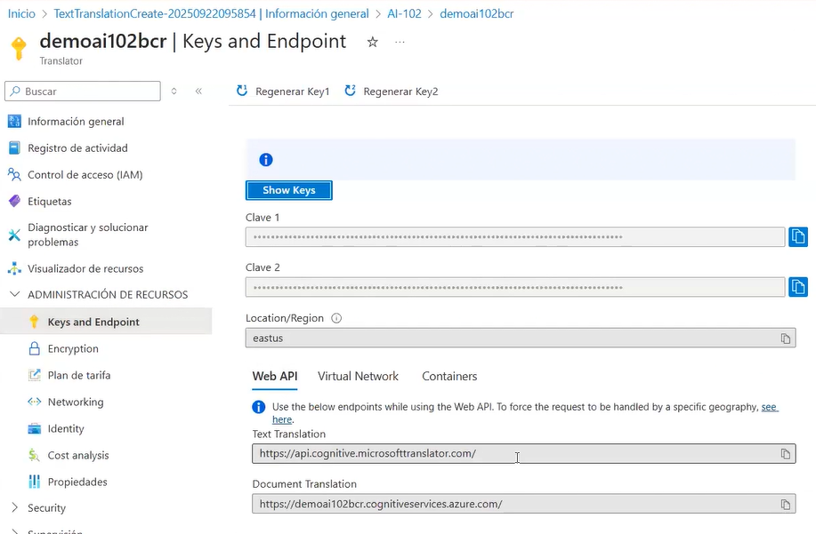
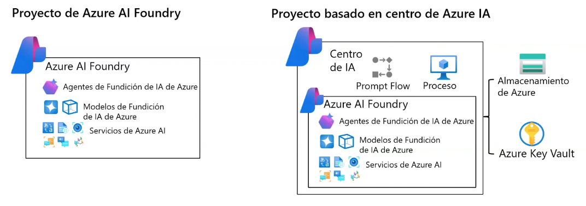
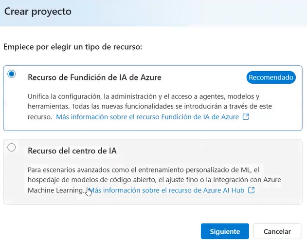
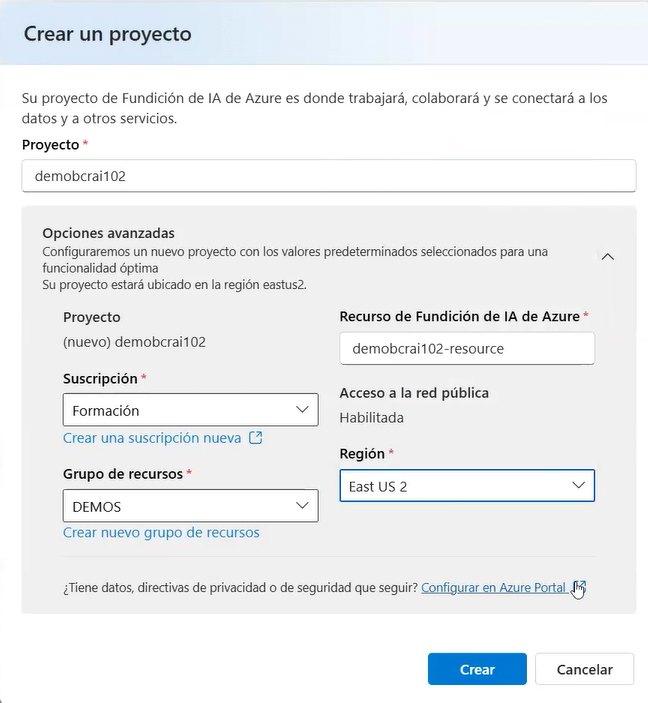
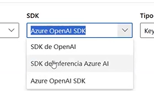
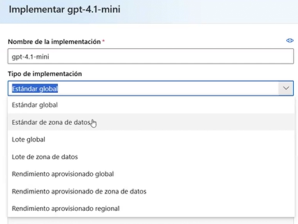
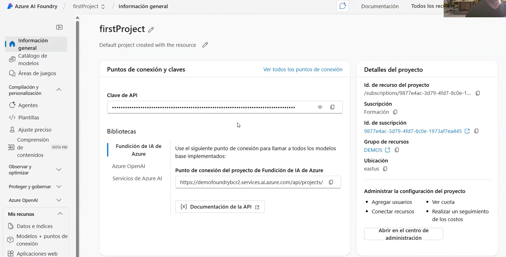
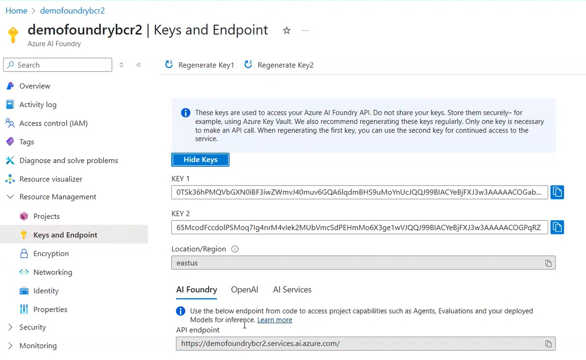
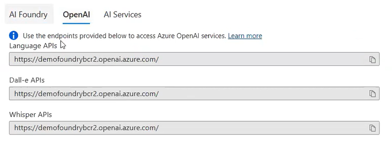

##  Azure AI Foundry Architecture (Control Plane, Resource, Data Plane)

### **1. Azure AI Foundry (Control Plane – Orchestration Layer)**

**Location:** https://ai.azure.com  
Azure AI Foundry manages and orchestrates the lifecycle of your AI applications:

- project configuration  
- model deployment workflows  
- evaluation pipelines  
- UI and management experience  


> **This is the control plane. Models do NOT run here.**  
> This is the workspace you see in the screenshot (ai.azure.com), where you build agents, RAG flows, evaluate prompts, manage deployments, etc.
> This layer handles governance, configuration, and orchestration.


---

### **2. Azure AI Resource (Azure Portal – Infrastructure Boundary)**

**Location:** https://portal.azure.com 
This is the resource created in the Azure Portal that defines the technical boundary in which Foundry operates:

- region  
- network and security (VNET, Private Endpoints)  
- RBAC and access control  
- billing and quotas  
- linked Key Vault / Storage  

> **This resource is created and managed from the Azure Portal.**  
> It enables Foundry, applies policy, and enforces security/compliance requirements.

<p align="left"></p>


---

#### 🏗️ Resource Provisioning in Azure (What “Provisioning” Actually Means)

When you create an Azure AI Resource (or any Azure service) in the Azure Portal, Azure performs a process called **provisioning**.

Provisioning includes:

- creating the logical resource object  
- assigning infrastructure (compute, storage, networking)  
- applying Azure Policy, RBAC, and security rules  
- validating the region and SKU you selected  
- generating endpoints and access keys  
- leaving the resource in a fully operational state (“Provisioned / Succeeded”)  

In other words:

> **Provisioning = creating a resource + configuring and initializing everything Azure needs for that service to run.**

Examples:
- Creating an Azure AI Search service (for indexes and vector search used in RAG)  
- Creating a Translator/Speech/Vision resource  
- Creating a Foundry resource itself  
- Creating a Key Vault or Storage account linked to your project  

Whenever you click *Review + Create* in the Azure Portal and Azure deploys the resource,  
**that is the provisioning phase**.

---

### **3. Connected AI Resource (Azure OpenAI – Data Plane)**

**Runtime Location:** backend service (not directly visible; used via API endpoints)  
**Management Location:** via Azure Portal or automatically connected in Foundry  

This is the backend where models actually execute:

- model hosting and runtime execution  
- inference endpoints and API keys  
- quota and throughput limits  
- safety filters and enterprise access controls  

> **This is the data plane. Models like GPT-4o actually run here.**  
> Foundry (ai.azure.com) orchestrates calls to this backend when you run agents, chats, evaluations, or deployments.


---

### **4. Summary**

- **Azure AI Foundry (ai.azure.com)** → orchestration & workspace (control plane)  
- **Azure AI Resource (portal.azure.com)** → infrastructure & security boundary  
- **Azure OpenAI (backend)** → model execution & inference (data plane)


                      Azure Subscription
                              │
                              ▼
               ┌──────────────────────────────────┐
               │   Azure AI Resource (Portal)     │
               │  • Region                        │
               │  • Network / Security            │
               │  • RBAC                          │
               │  • Billing                       │
               │  • Key Vault / Storage           │
               └───────────────┬──────────────────┘
                               │ enables
                               ▼
               ┌───────────────────────────────────┐
               │   Azure AI Foundry (Control Plane)│
               │  • Project configuration          │
               │  • Model deployment workflows     │
               │  • Evaluations & pipelines        │
               │  • Management & monitoring        │
               └───────────────┬───────────────────┘
                               │ orchestrates
                               ▼
               ┌───────────────────────────────────┐
               │ Connected AI Resource (Data Plane)│
               │        Azure OpenAI Runtime       │
               │  • Model hosting & inference      │
               │  • Endpoints & API keys           │
               │  • Quotas & throughput            │
               │  • Safety filters & policies      │
               └───────────────────────────────────┘


## Azure AI Foundry Projects

In Azure AI Foundry, you manage resource connections, data, code, and other solution components inside **projects**.  
There are two types of projects:

<p align="left"></p>

<p align="left"></p>
---

### **1. Foundry Projects**

Foundry projects are associated with an Azure AI Foundry resource in an Azure subscription.  
They provide support for:

- Azure Foundry foundation models (including OpenAI models)  
- Azure AI Foundry Agent Service  
- Azure AI Services  
- Evaluation and responsible AI tools  

A Foundry resource supports the most common generative AI development tasks for apps and agents.  
In most cases, a Foundry project offers the right level of centralization with minimal administrative overhead.

You can work on Foundry projects through the Azure AI Foundry portal, easily adding connected resources and managing model/agent deployments.


<p align="left"></p>
---

### **2. Hub-based Projects**

Hub-based projects are associated with an **Azure AI Hub** in an Azure subscription.  
A hub-based project includes:

- an Azure AI Foundry resource  
- managed compute  
- support for Prompt Flow development  
- connected Azure Storage and Key Vault for secure data handling  

Azure AI Hub resources support more advanced scenarios such as Prompt Flow applications or model fine-tuning.  

They can be used both in the **Azure AI Foundry portal** and the **Azure Machine Learning portal**, enabling collaboration across:

- data scientists  
- ML engineers  
- developers  
- AI software engineers  


## 📁 My Resources

Azure AI Foundry provides a **My Resources** section inside each project.  
This section represents the complete inventory of assets your project relies on, including data stores, search indexes, and model endpoints.

### **1. Data & Indexes**

This area includes all data-related resources connected to the project:

- search indexes  
- vector indexes used for RAG  
- document ingestion sources  
- Azure AI Search resources  
- metadata stores  
- data collections and embeddings  

These resources support retrieval, grounding, evaluations, and agent-based workflows.

---

### **2. Models + Endpoints**

This section contains all model assets associated with the project:

- foundation models deployed in Azure AI Foundry  
- Azure OpenAI endpoints connected to the project  
- model deployments (GPT-4o, Phi-3, embeddings, etc.)  
- model configuration, quotas, and versions  

These endpoints represent the **model execution layer** used by agents, chat apps, Prompt Flow pipelines, and evaluation tools.

<p align="left"></p>

#### Model implementations

<p align="left"></p>

<p align="left"></p>

#### Model example
<p align="left"></p>

1. Autenticación mediante la clave de API

Para los puntos de conexión de API de OpenAI, implemente el Modelo para generar la URL del punto de conexión y una clave de API para autenticarse con el servicio. En esta muestra, el punto de conexión y la clave son cadenas que contienen la dirección URL del punto de conexión y la clave de API.

La dirección URL del punto de conexión de API y la clave de API se pueden encontrar en la página Implementaciones y punto de conexión una vez implementado el modelo.

Para crear un cliente con el SDK de OpenAI usando una clave de API, inicialice el cliente pasando su clave de API a la configuración del SDK. Esto le permite autenticarse e interactuar con los servicios de OpenAI sin problemas:


```bash
import os
from openai import AzureOpenAI

client = AzureOpenAI(
    api_version="2024-12-01-preview",
    azure_endpoint="https://demobcrail02-resource.cognitiveservices.azure.com/",
    api_key=subscription_key,
)
```

**Ejecutar un ejemplo de codigo basico**

```bash
import os
from openai import AzureOpenAI

endpoint = "https://demobcrail02-resource.cognitiveservices.azure.com/"
model_name = "gpt-4.1-mini"
deployment = "gpt-4.1-mini-2"

subscription_key = "<your-api-key>"
api_version = "2024-12-01-preview"

client = AzureOpenAI(
    api_version=api_version,
    azure_endpoint=endpoint,
    api_key=subscription_key,
)

```

## 🔧 Azure OpenAI – Deployment Types 

Azure OpenAI offers multiple deployment modes depending on latency requirements, data-residency constraints, and guaranteed throughput expectations.

### 1. Global Standard

- Inference served from Azure’s global infrastructure.
- Optimized latency and high availability.
- No strict data-residency guarantees.

### 2. Data-Zone Standard

- Processing confined to a specific Data Zone.
- Ensures regional data residency.
- Suitable for moderately regulated sectors.

### 3. Global Batch

- Optimized for non–real-time batch processing.
- Lower cost and high throughput.
- Ideal for large-scale offline workloads.

### 4. Data-Zone Batch

- Batch mode with data restricted to a Data Zone.
- Supports regulatory compliance for offline workloads.

### 5. Global Provisioned Throughput

- Dedicated, guaranteed capacity (PTUs) at a global level.
- No throttling, predictable latency.
- Requires a capacity contract.

### 6. Data-Zone Provisioned Throughput

- Dedicated capacity with strict data-residency boundaries.
- Suitable for financial services and regulated workloads.

### 7. Regional Provisioned Throughput

- Dedicated capacity tied to a single Azure region.
- Maximum residency control and regulatory compliance.
- Higher cost; used for mission-critical systems.

<p align="left"></p>

## Azure AI Foundry

#### **1. General information**

In the **General Information (overview)** section of Azure AI Foundry, you will see the project-level endpoint and the project API key.
This key is always the same for the project and is used to authenticate against the Foundry control plane.

<p align="left"></p>

If you go to the Azure Portal and open the underlying Azure AI Resource, you will typically find two resource keys.
These keys belong to the data plane and are used for model inference (Azure OpenAI runtime).

<p align="left"></p>

On this page you can also see the runtime endpoints exposed by Azure OpenAI.
Azure displays separate categories (Language APIs, Dall-E APIs, Whisper APIs), but in reality they all point to the same base endpoint:

```bash
https://<resource-name>.openai.azure.com/
https://demofoundrybcr2.openai.azure.com/
```

<p align="left"></p>

- **AI Foundry Endpoint** → for project management and orchestration (not inference).
- **Azure OpenAI Endpoint** → for running GPT/DALL·E/Embeddings/Whisper deployments.
- **Azure AI Services Endpoint** → for Speech, Vision, Translation, OCR, Content Safety, etc.


> **Note:** When running code locally (VS Code, terminal, scripts, Jupyter, Postman…),
you must always use the Azure OpenAI Resource endpoint + Resource Key,
NOT the Foundry Project key or Foundry endpoint.

```bash
from openai import AzureOpenAI

client = AzureOpenAI(
    api_key="YOUR_RESOURCE_KEY",
    azure_endpoint="https://demofoundrybcr2.openai.azure.com/",
    api_version="2024-02-15-preview"
)

response = client.chat.completions.create(
    model="gpt-4.1-mini-2",   # your deployment name
    messages=[{"role": "user", "content": "Hello from VS Code!"}]
)

print(response.choices[0].message.content)
```

The endpoint you must use in your application code (Python, JS, REST, etc.) is the **Azure OpenAI Resource endpoint** shown in the **Azure Portal**. This endpoint represents the data-plane runtime for model execution, and it is the only endpoint capable of serving inference requests such as chat completions, embeddings, image generation, or audio transcription.

Control-plane endpoints from Azure AI Foundry (ai.azure.com) or Cognitive Services endpoints (cognitiveservices.azure.com) cannot execute OpenAI models and must not be used in SDK integrations. Only the resource-level OpenAI endpoint ( https://<resource>.openai.azure.com ) supports authenticated model inference using the Resource Keys (Key 1 / Key 2).


## 🧩 Alternatives: OLLAMA (Local LLM Runtime)


In addition to Azure OpenAI, you can run large language models locally using Ollama.
Ollama provides a lightweight runtime for serving open-source LLMs on your workstation (CPU or GPU), making it useful for:

- Offline experimentation
- Rapid prototyping without cloud dependencies
- Testing prompts or workflows before deploying to Azure

```bash
# Download or update a model
ollama pull <model-name>

# List all locally available models
ollama list

# Run a model interactively or execute a prompt directly
ollama run gpt-oss "List 10 countries that start with the letter A"
```

### How it works

- `ollama pull <model-name>` downloads a model (e.g., `mistral`, `llama3`, `phi3`, `gpt-oss`) from the Ollama model registry.  
- `ollama list` displays all models currently installed on your machine.  
- `ollama run` launches a local instance of the model and processes your prompt.  

You can call this endpoint from Python, JavaScript, cURL, or any HTTP client.

---

###  Why it can be useful

- Enables local development without consuming Azure tokens.  
- Lets you test **RAG pipelines**, **embeddings**, or **prompt engineering** without deployment overhead.  
- Allows quick comparison between **open-source LLMs** and **Azure OpenAI models**.  
- Useful in **restricted connectivity environments** or when **on-device privacy** is required.

---

### ⚠️ Important Note

Ollama models run entirely on your local machine, which means they do **not** provide:

- enterprise-grade availability  
- SLA guarantees  
- security hardening  
- compliance required for regulated sectors (banking, insurance, healthcare, etc.)

Because of this, Ollama is excellent for **experimentation, prototyping, and development**,  
but **not suitable for production** workloads in enterprise or regulated environments.

---


