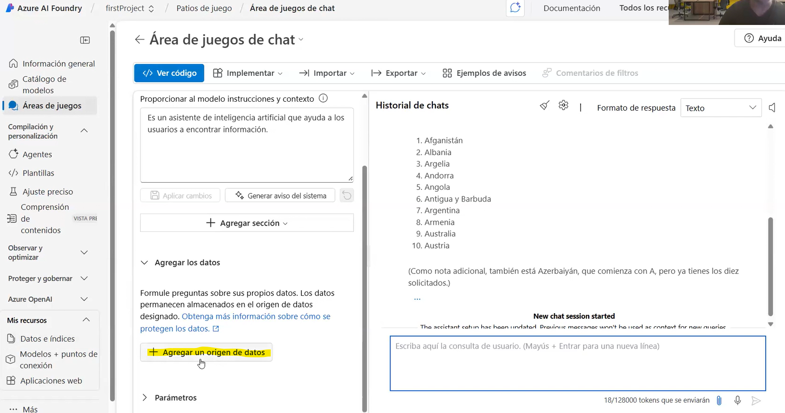

## Grounding a Language Model With Your Own Data

Large language models can generate fluent and coherent answers, but **what information are those answers based on?**
On their own, LLMs rely only on their **original training data**, which may not include your organization’s products, policies, or internal knowledge.

**Grounding** provides the model with domain-specific context so that it can return precise, relevant, and up-to-date responses.

  

**Without Grounding**

- The model only uses its pre-training data.
- Responses may be grammatically correct but not contextualized.
- The model cannot access your product catalogs, documents, or internal knowledge.

**With Grounding**

- The model retrieves information from your enterprise data sources (e.g., product catalog).
- The retrieved content is injected into the prompt.
- The result is a context-aware, accurate, and relevant answer tailored to your business.

## Retrieval-Augmented Generation (RAG)

**Retrieval-Augmented Generation (RAG)** enhances a language model’s responses by supplementing the user’s query with relevant information retrieved from an external knowledge source.  
Instead of relying solely on the model's pre-training data, RAG retrieves domain-specific content (documents, product catalogs, policies, embeddings, etc.) and injects it into the prompt before inference.

A **RAG pattern** is an architectural approach that improves accuracy, reduces hallucinations, and ensures answers remain aligned with your organization’s internal knowledge.

 

### **How RAG Works**

1. **Retrieve relevant data**  
   Based on the user’s input, the system performs a search (often vector-based) to find the most relevant documents or pieces of information.

2. **Augment the query with retrieved content**  
   Retrieved passages or documents are merged with the user’s question to create a *grounded prompt*.

3. **Generate a contextualized response**  
   The model uses both the user input and the retrieved context to produce an accurate, tailored, and reliable answer.

 

   

