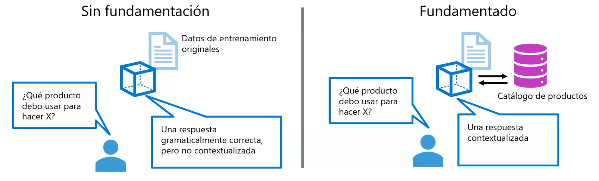

## Grounding a Language Model With Your Own Data

Large language models can generate fluent and coherent answers, but **what information are those answers based on?**
On their own, LLMs rely only on their **original training data**, which may not include your organization’s products, policies, or internal knowledge.

**Grounding** provides the model with domain-specific context so that it can return precise, relevant, and up-to-date responses.

  

**Without Grounding**

- The model only uses its pre-training data.
- Responses may be grammatically correct but not contextualized.
- The model cannot access your product catalogs, documents, or internal knowledge.

**With Grounding**

- The model retrieves information from your enterprise data sources (e.g., product catalog).
- The retrieved content is injected into the prompt.
- The result is a context-aware, accurate, and relevant answer tailored to your business.
